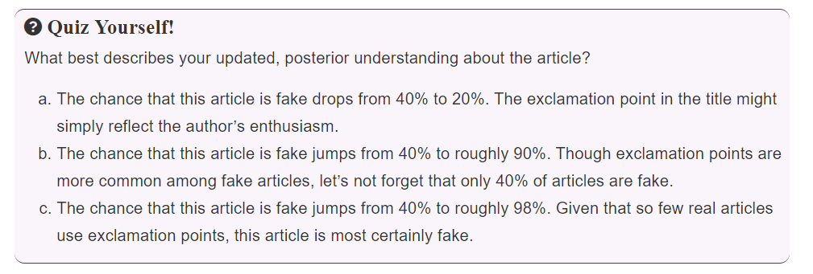

# Bayes' Rule

```{r 02-load-packages, message=FALSE, echo=FALSE}
library(tidyverse)
library(bayesrules)
library(janitor)
library(gt)
library(latex2exp)
```

**Learning objectives:**

-   Explore foundational probability tools

    -   conditional probability: probability of $A$ given $B$, $P(A|B)$

    -   joint probability: probability of $A$ and $B$ occurring together, $P(A \cap B)$

    -   marginal probability: probability of an event $A$, $P(A)$

    -   law of total probability: if a probability of an event $A$ is unknown it can be calculated using the known probability of other related events such as $A \cap B$ and $A|B$

-   Conduct first formal Bayesian analysis

-   Practice your Bayesian grammar

    -   Prior

    -   Likelihood

    -   Normalizing constant

-   Simulate Bayesian models

    -   `sample()`

    -   `sample_n()`

    -   `rbinon()`

## Building a Bayesian model for events

**The `fake_news` data set**

```{r, fig.cap="Bayesian knowledge-building diagram for wether or not the article is fake", echo=FALSE}
DiagrammeR::grViz("
  digraph {
  
  # node statement
  node [shape = oval]
  a [label = 'Prior: 40% of the articles\nare fake'];
  b [label = 'Data: ! more common\namong fake news'];
  c [label = 'Posterior: Is the article\nfake or not?!'];

  # edge statement
  a -> c b -> c
  }")
```

Two variables:\
- fake vs real\
- contains exclamation (!) or not



### Workflow:

1.  Prior probability model

2.  A model for interpreting the data

3.  Posterior probability model

## Prior probability model

A valid probability model must:

1.  account for all events;

2.  assign probabilities for each event;

3.  sum to one.

In our `fake_news` example, the prior probability model is defined as:

$P(\text{is fake}) = 0.4$ and $P(\text{is real}) = 0.6$

## Model for interpreting the data

If the event "*is fake"* is know and "*has !*" is unknown then the **conditional probability function** allows us to compare the probabilities of "has !" with being fake or real:

$P(\text{has ! | is fake})$ and $P(\text{doesn't have ! | is fake})$

If the event "*is fake"* is unknown and "*has !*" is known then the **likelihood function** allows us to evaluate the relative compatibility of the data, "*has !*" with the event of being fake or real:

$L(\text{is fake | has !})$ and $L(\text{is real | has !})$

where,

$L(\text{is fake | has !}) = P(\text{has ! | is fake})$ and

$L(\text{is real | has !}) = P(\text{has ! | is real})$

```{r, echo=FALSE}
fake_news |> 
  tabyl(type, title_has_excl) |> 
  adorn_percentages() |> 
  adorn_pct_formatting(digits = 1) |> 
  gt() |> 
  tab_spanner(label = "has !", columns = -1) |> 
  tab_style(style = list(cell_fill("steelblue", alpha = 0.15), cell_text(weight = "bold")),
            locations = cells_body(columns = "TRUE")) |> 
  cols_width(2:3 ~ px(100)) |> 
  tab_options(table.border.top.style = "hidden")
```

Since the **likelihood function** is not a true probability model, we need a **normalizing constant**. Here it will be $P(\text{has !})$, i.e., the probability of observing the data.

\begin{equation}
\begin{split}
  \text{normalizing constant} &= P(\text{has !}) \\
                              &= P(\text{has ! }\cap \text{ is real}) + P(\text{has ! }\cap \text{ is fake}) \\
                              &= P(\text{is real}) \cdot P(\text{has ! | is real}) + P(\text{is fake}) \cdot P(\text{has ! | is fake}) \\
                              &= 0.6 \times 0.022 + 0.4 \times 0.267 \\
                              &= 0.12
\end{split}
\end{equation} 

The formula used to calculate the normalizing constant is also called the **law of total probability**.

## Posterior probability model

The posterior probability model is defined as: $P(\text{is fake | has !})$ and $P(\text{is real | has !})$

and this can be calculated using **Bayes' Rule**:

$$
\text{posterior} = \frac{\text{prior} \times \text{likelihood}}{\text{normalizing constant}}
$$

```{r, echo=FALSE}
prior <- c(0.4, 0.6)
likelihood <- c(0.2667, 0.0222)
normalizing_constant <- sum(prior * likelihood)
posterior <- prior * likelihood / normalizing_constant
summary_table <- 
  tibble(type = c("fake", "real"), prior = prior, likelihood = likelihood, posterior = posterior) |> 
  pivot_longer(-type) |> 
  pivot_wider(names_from = type, values_from = value) |> 
  adorn_pct_formatting(digits = 1) 

gt(summary_table) |> 
  cols_label(name = "", fake = "Fake", real = "Real") |> 
  cols_width(1 ~ px(120), 2:3 ~ px(100)) |> 
  tab_style(style = list(cell_text(weight = "bold")),
            locations = cells_body(rows = 3))
```

Shortcut to calculating the normalizing constant:

$$
\text{normalising constant} = \text{sum}(\text{prior} \times \text{likelihood})
$$

## Posterior simulation

We can also validate the posterior model derived using the Bayes' Rule via simulation.

Start off with specifying the prior and the likelihoods.

```{r}
prior <- list(fake = 0.4, real = 0.6)
likelihood <- list(fake = 0.2667, real = 0.0222)
```

We then simulate 10,000 articles as either "real" or "fake" based on the prior probabilities.

```{r}
set.seed(84735)
articles <- sample_n(tibble(type = c("fake", "real")), size = 10000, 
                     weight = prior, replace = TRUE)
```

```{r, echo=FALSE}
articles |> 
  tabyl(type) |> 
  adorn_totals("row") |> 
  adorn_pct_formatting(digits = 1) |> 
  gt() |> 
  tab_header("Summary of simulated articles") |> 
  tab_options(table.border.top.style = "hidden")
```

Against these simulated we add an attribute - "does it have an exclamation (!) mark" based on the likelihoods.

```{r}
articles <- articles |>
  mutate(data_model = if_else(type == "fake", likelihood$fake, 
                              likelihood$real)) |> 
  rowwise() |>
  mutate(has_exclam = sample(c(T, F), 1, prob = c(data_model, 1-data_model)))
```

Finally, we filter for those articles which have an exclamation mark and compute the probabilitiy of them being "fake" or "real". This gives us the **posterior probability (simulated)**.

```{r}
posterior_prob_sim <- 
  articles |> 
  filter(has_exclam) |> 
  tabyl(type) |> 
  adorn_pct_formatting(digits = 1) |> 
  pull(percent) 
```

```{r, echo=FALSE}
summary_table |> 
  rbind(c("posterior (simulated)", posterior_prob_sim)) |> 
  gt() |> 
  cols_label(name = "", fake = "Fake", real = "Real") |> 
  cols_width(1 ~ px(180), 2:3 ~ px(100)) |> 
  tab_style(style = list(cell_text(weight = "bold")),
            locations = cells_body(rows = 4))
```

## Example Pop vs Soda vs Coke

Define the prior probability model.

```{r}
prior <- c("midwest" = 0.21, "northeast" = 0.17, "south" = 0.38, "west" = 0.24)
```

```{r, echo=FALSE}
tibble(region = "probability") |> 
  bind_cols() |> 
  tibble(regions = names(prior),
       prior = prior) |> 
  pivot_wider(names_from = regions, values_from =  prior) |> 
  adorn_pct_formatting(digits = 1) |> 
  gt() |> 
  tab_header("Prior probability model") |> 
  cols_width(1 ~ px(120), everything() ~ px(100)) |> 
  tab_options(column_labels.font.weight = "bold", table.border.top.style = "hidden")
```

```{r}
likelihood <- pop_vs_soda |> 
  tabyl(pop, region) |> 
  adorn_percentages("col") |> 
  filter(pop) |> 
  select(-pop)
```

```{r, echo=FALSE}
tibble(region = "likelihood") |> 
  bind_cols() |> 
  tibble(regions = names(likelihood),
       likelihood = as_vector(likelihood)) |> 
  pivot_wider(names_from = regions, values_from =  likelihood) |> 
  adorn_pct_formatting(digits = 1) |> 
  gt() |> 
  tab_header("Data model (likelihoods)") |> 
  cols_width(1 ~ px(120), everything() ~ px(100)) |> 
  tab_options(column_labels.font.weight = "bold", table.border.top.style = "hidden")
```

```{r}
posterior <- prior * likelihood / sum(prior * likelihood)
```

```{r, echo=FALSE}
tibble(region = names(prior), prior = prior, likelihood = as_vector(likelihood), posterior = as_vector(posterior)) |> 
  pivot_longer(cols = -region) |> 
  pivot_wider(names_from = region, values_from = value) |> 
  adorn_pct_formatting() |> 
  gt() |> 
  tab_header("Posterior porbability model") |> 
  cols_width(1 ~ px(120), everything() ~ px(100)) |> 
  cols_label(name = "") |> 
  tab_style(style = cell_text(weight = "bold", color = "crimson"),
            locations = list(cells_body(4, 1), cells_body(2, 3))) |> 
  tab_options(column_labels.font.weight = "bold",  table.border.top.style = "hidden")
```

We can summarize the key observations from this analysis is the form of the below graph.

```{r, echo=FALSE}
DiagrammeR::grViz("
  digraph {
  # node statement
  node [shape = oval]
    a [label = 'Prior: The person is most likely\nfrom the south'];
    b [label = 'Data: People from the mid-west are most\nlikely to call the drink pop'];
    c [label = 'Posterior: The person is most likely\nfrom the mid-west'];

  # edge statement
  a -> c b -> c
  }")
```

## Building a Bayesian model for random variables

Here we will be modelling the probability ($\pi$) of Kasparov defeating Deep Blue in a game of chess.

### Prior probability model

This is based on the matches played between Kasparov and Deep Blue in 1996.

|$\pi$    | 0.2 | 0.5  | 0.8  | Total |
|:----------|:---:|:----:|:----:|:-----:|
|$f(\pi)$ | 10.0% | 25.0% | 65.0% |   100.0%   |


**R code for prior probability model:**

```{r}
pi <- c(0.2, 0.5, 0.8)
prior_prob <- c(0.1, 0.25, 0.65)
```

### Data model

The number of matches won ($Y$) by Kasparov in the 1997 encounter will serve as the data in this setup. 

In the end Kasparov just one out of the six matches played in 1997, i.e., $Y = 1$

**R code for binomial data model (likelihood function):**

```{r}
likelihoods <- map_dbl(pi, ~dbinom(1, 6, .x))

ggplot(mapping = aes(x = pi, y = likelihoods)) +
  geom_point(size = 3) +
  geom_segment(aes(xend = pi, yend = 0)) +
  scale_x_continuous(breaks = pi) +
  xlab(TeX(r"($\pi$)")) +
  ylab(TeX(r"($L(\pi | y = 1)$)"))
```

### Posterior probability model 

We can now combine the prior and likelihood to derive the posterior probabilities.

**R code for posterior probability model:**

```{r}
posterior_prob <- prior_prob * likelihoods / sum(prior_prob * likelihoods)

tibble(pi = pi, prior = prior_prob, posterior = posterior_prob) |> 
  pivot_longer(cols = -pi, values_to = "probability") |> 
  mutate(name = fct_rev(name)) |> 
  ggplot() +
  geom_col(aes(pi, probability, fill = name), position = "dodge") +
  scale_x_continuous(breaks = pi) +
  theme(legend.title = element_blank())
```

### Posterior simulation 

```{r}
set.seed(84735)

sim_results <- 
  tibble(pi = sample(pi, 10000, replace = TRUE, prob = prior_prob)) |> 
  rowwise() |> 
  mutate(games_won = rbinom(1, 6, pi)) |> 
  filter(games_won == 1) |> 
  tabyl(pi) |> 
  rename(posterior_sim = percent) |> 
  mutate(posterior = posterior_prob)

sim_results |> 
  select(-n) |> 
  adorn_pct_formatting() |> 
  gt() |> 
  cols_width(1 ~ px(50), everything() ~ px(120)) |> 
  tab_header("Simulating the posterior probabilities")
```


## Links shared in the second meeting

Bayesian probability for babies! (with cookies) : <https://raw.githubusercontent.com/epimath/epid-814-materials/master/Lectures/BayesianEstimation.pdf> Author: Marisa Eisenberg

## Meeting Videos

### Cohort 1

`r knitr::include_url("https://www.youtube.com/embed/-6f60j96d58")`

<details>

<summary>Meeting chat log</summary>

    00:11:44    erik.aalto@tocaboca.com:    Hello, sorry for joining late, happy to see you again 😄
    00:36:06    Brendan Lam:    https://www.youtube.com/watch?v=HZGCoVF3YvM
    00:37:26    Erik:   we’ll utilize the following likelihood function notation  
    <poorly formatted paste>
    00:37:41    Erik:   sorry for how the formatting above went…
    00:42:42    Lisa:   to add to brendan's resource, here is a slide deck using cookies as an example: https://github.com/epimath/epid-814-materials/blob/master/Lectures/BayesianEstimation.pdf
    01:02:00    Federica Gazzelloni:    thanks
    01:02:34    Federica Gazzelloni:    I’d like to go back to the L(..|..)
    01:02:35    Gabby Palomo:   It was clear Olivier. Don’t worry!!
    01:03:07    Federica Gazzelloni:    just to understand how it works and what is the difference
    01:03:43    Erik:   Need to jump out! Thanks for today.
    01:04:15    Lisa:   I need to get back to work too. thank you for today!
    01:04:58    Federica Gazzelloni:    thanks
    01:05:03    Federica Gazzelloni:    I’ll check that

</details>

### Cohort 2

`r knitr::include_url("https://www.youtube.com/embed/2gP7rLLLUsA")`

`r knitr::include_url("https://www.youtube.com/embed/QirQynPol0k")`

### Cohort 3

`r knitr::include_url("https://www.youtube.com/embed/RygccxWeHSE")`

### Cohort 4

`r knitr::include_url("https://www.youtube.com/embed/SOlXj1Bvv7E")`
