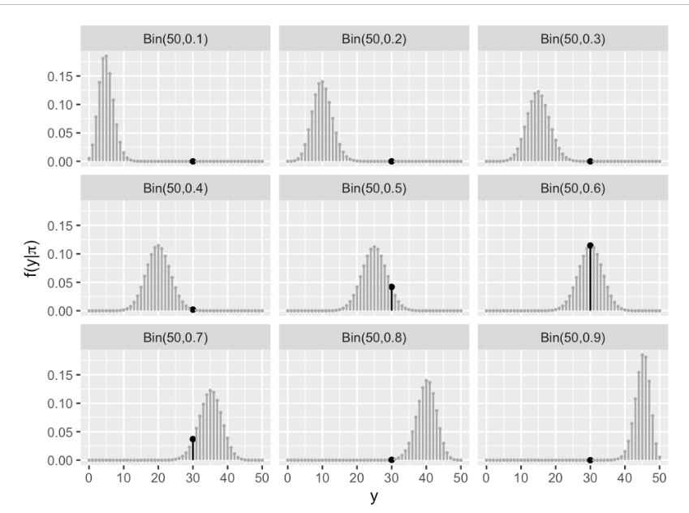
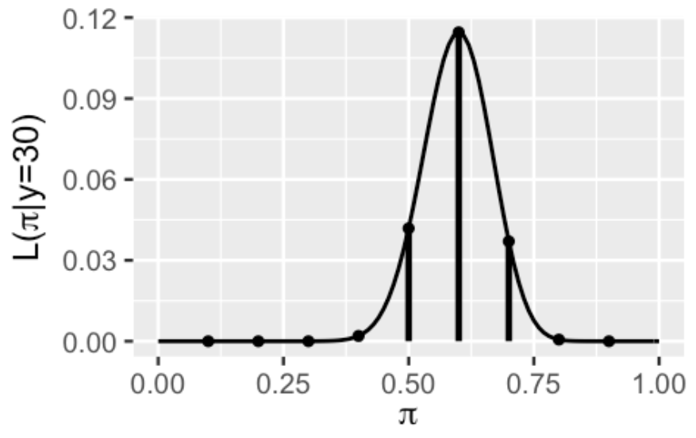
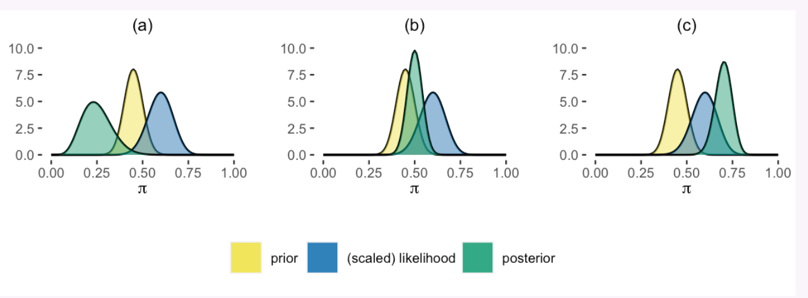

# The Beta-Binomial Bayesian Model

**Learning objectives:**

- We will learn how to interpret and tune a continuous Beta prior model to reflect your prior information about $\pi$

- We will learn how to interpret and communicate features of prior and posterior models using properties such as mean, mode, and variance

- Construct the fundamental Beta-Binomial model for proportion $\pi$
 
To prepare for this chapter, note that we’ll be using three Greek letters throughout our analysis: $\pi$ = pi, $\alpha$ = alpha, and $\beta$ = beta. Further load the packages below.

```{r,message=FALSE,warning=FALSE}
library(bayesrules)
library(tidyverse)
```


## What is a Beta Binomial model for ?
- It is a model we use when we want to look at something with a proportion.

- Examples of use: The proportion of people that use public transit, the proportion of trains that are delayed, the proportion of people that prefer cats to dogs, and so on.

- The Beta-Binomial model provides the tools we need to study the proportion of interest,$\pi$, in each of these settings.

## The Beta Prior Model
- The first model we are going to construct is based on a scenario where you are a campaign manager for Michelle for president campaign in the state of Minnesota.

- So far we have conducted 30 opinion pools. Michelle's support is generally around 45% but has been as low as 35% and as high as 55%. 

This is going to form the basis for our prior.

### Are we good so far ?


## How has the model changed from last week ?
The example of Kasparov's probability of beating Deep Blue at chess was a discrete example.

In that case, we greatly over-simplified reality to fit within the framework of introductory Bayesian models. Mainly, we assumed that $\pi$ could only be 0.2, 0.5, or 0.8, the corresponding chances of which were defined by a discrete probability model.

- However, in the reality of Michelle's election support and Kasparov's chess skill, $\pi$ can be any value between 0 and 1. We can reflect this reality and conduct a more nuanced Bayesian analysis by constructing a continuous prior probability model.

 So ....
 
 - Probability density functions for *continuous* models
 
rather than
 
 - Probability mass functions  for discrete models
 
## What quality does the probability density function have ?

Let $\pi$ be a continuous random variable with *probability density function* $f(\pi)$.  Then $f(\pi)$ has the following properties:

- The proportion has to be greater than or equal to zero

$$f(\pi) \geq 0$$

- The area under the curve sums to 1

$$\int_{\pi} \! f(\pi) \, d\pi = 1$$

- The area under the curve between a and b sums to the probability of pie being in that range.

$$P(a < \pi < b) = \int_{a}^{b} \! f(\pi) \, d\pi$$

## Tuning the Beta Prior
This is a process of trial and error

**Plot the Beta(45,55) prior**

```{r}
# beta distribution with hyperparameters
# alpha = 45
# beta = 55
bayesrules::plot_beta(45,55, mean = FALSE, mode = FALSE)
```

$$\text{E}(\pi) = \frac{\alpha}{\alpha + \beta} = \frac{45}{45 + 55} = 0.45$$
$$\text{Mode}(\pi) = \frac{\alpha-1}{\alpha+\beta-2} = \frac{45-1}{45+55-2} \approx 0.4490$$

```{r}
# beta distribution with hyperparameters
# alpha = 45
# beta = 55
bayesrules::plot_beta(45,55, mean = TRUE, mode = TRUE)
```


## The Binomial Data Model and Likelihood

- This is where we gather some new data by conducting an opinion poll. on this occasion we ask 50 people who are they supporting and 30 of them are supporting Michelle.


 Binomial Data Model and Likelihood




The likelihood function, $L(\pi$|Y =30), of Michelle's election support $\pi$ given the observed poll in which Y = 30 of n=50 polled Minnesotans supported her. The vertical lines represent the likelihood evaluated at $\pi$ in {0.1,0.2,....0.9}.

## Beta Posterior Model

We now have two pieces of our Bayesian model in place – the Beta prior model for Michelle’s support $\pi$ and the Binomial model for the dependence of polling data Y on $\pi$:

Y|$\pi$ ~ Bin(50,$\pi$)

$\pi$ ~ Beta(45,55)

- The prior and data, as captured by the likelihood, don’t completely agree. 

- Constructed from old polls, the prior is a bit more pessimistic about Michelle’s election support than the data obtained from the latest poll. 

- Yet both insights are valuable to our analysis. Just as much as we shouldn’t ignore the new poll in favor of the old, we also shouldn’t throw out our bank of prior information in favor of the newest thing (also great life advice). 

- Thinking like Bayesians, we can construct a posterior model of $\pi$ which combines the information from the prior with that from the data.


The Posterior model of $\pi$ along with the (scaled) likelihood function of $\pi$ given the new poll results in which Y = 30 of n = 50 polled Minnesotans support Michelle.

**What are we missing from this plot ?**

**Which plot reflects the correct posterior model of Michelle’s election support $\pi$?**



## Plot of the Beta Posterior Model
```{r,echo=TRUE,warning=FALSE,message=FALSE}
plot_beta_binomial(alpha = 45, beta = 55, y = 30, n = 50)
```

**The beta posterior model was choice B** because this posterior model strikes a *balance* between the prior and the likelihood.

<!--
The prior pdf, scaled likelihood function, and posterior pdf of Michelle’s election support $\pi$.
-->

## Effects of New Data ?

```{r}
summarize_beta_binomial(alpha = 45, beta = 55, y = 30, n = 50)
```

A comparison illuminates the polling data’s influence on the posterior model. 

- After observing the poll in which 30 of 50 people supported Michelle, the expected value of her underlying support $\pi$ nudged up from approximately 45% to 50%.

- The variance has also decreased.

## Simulating the Beta-Binomial

- Here we are going to simulate the posterior model of Michelle's support $\pi$. We begin by simulating **10,000** values of $\pi$ from **Beta(45,55)** prior using **rbeta()** and, subsequently, a potential Bin(50,$\pi$) poll result **Y** from each $\pi$ using **rbinom()**


- The resulting 10,000 pairs of $\pi$ and Y values are shown below. In general, the greater Michelle’s support, the better her poll results tend to be. Further, the highlighted pairs illustrate that the eventual observed poll result, Y=30 of 50 polled voters supported Michelle, would most likely arise if her underlying support $\pi$ were somewhere in the range from 0.4 to 0.6.
  

```{r,message=FALSE,warning=FALSE}
michelle_sim <- data.frame(pi = rbeta(10000,45,55)) |> 
  mutate(y=rbinom(10000,size=50,prob=pi))

ggplot(data=michelle_sim,aes(x=pi, y=y))+
  geom_point(aes(color=(y==30)),
  
             # added for visibility           
             size=0.5, alpha = 0.5) +
  labs(title = "Simulating the Beta-Binomial") +
  theme_minimal()
```

- Separate out from the simulation the results that match your new data where 30 out of 50 are supporting Michelle.

```{r}
# Keep the simulated pairs that match your data

michelle_posterior <- michelle_sim |> 
  filter(y==30)

head(michelle_posterior)
```

## What does this show ?

```{r}
ggplot(data=michelle_posterior,aes(x=pi))+
  geom_density()
```
```{r}
michelle_posterior |> 
  summarise(mean(pi),sd(pi))


# We can also check the number of data points it is based on

nrow(michelle_posterior)

```

## Case Study: Milgram's Behavior Study of Obedience

- This is the famous study where the subjects were asked to deliver an electric shock to an actor under the ruse of a study on the effect of punishment on memory.

- In reality what was being tested was obedience to authority and the conflict with personal conscience.


- published in 1963 in *The Journal of Abnormal and Social Psychology*

## What do you think the prior beliefs were?

Given the Beta(1,10) prior model, what does that reveal about the psychologist's *prior* understanding of $\pi$

a) They don't have an informed opinion

b) They are fairly certain that a large proportion of people will do what authority tells them.

c) They are fairly certain that only a small proportion of people will do what authority tells them.

## Let plot them to find out

```{r}
# Beta(1,10) prior
plot_beta(alpha = 1,beta = 10)
```

$$\text{E}(\pi) = \frac{\alpha}{\alpha + \beta} = \frac{1}{1 + 10} = \frac{1}{11}$$
$$\text{Mode}(\pi) = \frac{\alpha-1}{\alpha+\beta-2} = \frac{1-1}{1+10-2} = 0$$

The psychologist's prior understanding *expected* that only a small proportion of people will do what authority tells them at about 1:10 odds.


## So what actually happened ?

- Obedience to authority won out

- The prior was not supported by the evidence

- The data collected showed that 26 out of 40 participants inflicted the maximum electric shock.

## What conclusions can we draw ?

- Prior: though they started out with an understanding that fewer than ~25% of people would inflict the most service shock.

- Data: given the strong counter evidence in the study area.

- Posterior: they now understand this figure to be somewhere between ~30% and ~70%.

## Updating the Model

```{r}
# prior: Beta(alpha = 1, beta = 10)
# evidence: The data collected showed that 26 out of 40 
# participants inflicted the maximum electric shock.
plot_beta_binomial(alpha = 1, beta = 10, y = 26, n = 40)
```

```{r}
summarize_beta_binomial(alpha = 1, beta = 10,
                        y = 26, n = 40)
```


## Summary

We can build a Beta-Binomial model for unknown proportion anywhere between 0 and 1

$$\begin{array}{rcl}
Y|\pi & \sim & \text{Bin}(n,\pi) \\ \pi &  \sim & \text{Beta}(\alpha,\beta)
\end{array} \quad\Rightarrow\quad \pi|(Y = y) \sim \text{Beta}(\alpha + y, \beta + n - y)$$

Like every Bayesian analysis Beta-Binomial models have four common elements.

1. **Prior model**: The Beta prior model for $\pi$ can be tuned to reflect the relative prior plausibility for each $\pi \in [0,1]$

$$f(\pi) = \frac{\Gamma(\alpha + \beta)}{\Gamma(\alpha)\Gamma(\beta)}\pi^{\alpha-1}(1-\pi)^{\beta-1}$$

2. **Data model**: We collect data $Y$, whose dependence on $\pi$ is summarized by $\text{Bin}(n,\pi)$

3. **Likelihood function**: compare the compatibility of the data with different values of $\pi$

$$L(\pi|y) = \binom{n}{y}\pi^{y}(1-\pi)^{n-y} \quad\text{for}\quad \pi \in [0,1]$$

4. **Posterior model**: via Bayes' Rule, the **conjugate** Beta prior combined with the Binomial data model produce a Beta posterior model for $\pi$.

$$f(\pi|y) \propto f(\pi)L(\pi|y) \propto \pi^{(\alpha+y)-1}(1-\pi)^{(\beta+n-y)-1}$$


- we say that $f(\pi)$ is a *conjugate prior* for $L(\pi|y)$ if the posterior, f(\pi|y) \propto f(\pi)L(\pi|y), is from the same model family as the prior
  
- the updated Beta posterior $(\alpha+y, \beta+n-y)$ reflect the influence of the prior (via $\alpha$ and $\beta$ and the observed data (via $y$ and $n$)


## Meeting Videos

### Cohort 1

`r knitr::include_url("https://www.youtube.com/embed/Ne4kGkl7M1w")`

<details>
<summary> Meeting chat log </summary>

```
00:10:55	Kasia Ozga:	host disabled whitboard so we will not try it 😛
00:30:25	Will Parbury:	3 Blue 1 Brown: Binomial distributions | Probabilities of probabilities, part 1 https://www.youtube.com/watch?v=8idr1WZ1A7Q

Serrano.Academy: The Beta Distribution in 12 minutes! https://www.youtube.com/watch?v=juF3r12nM5A

PsychEd: Milgram’s Obedience Experiment https://www.youtube.com/watch?v=cBDkJ-Nc3Ig
00:30:38	Federica Gazzelloni:	thanks
00:35:29	Federica Gazzelloni:	you can watch the fist two videos of advancedR cohort6 book club for how to make the notes
00:36:32	Federica Gazzelloni:	https://www.youtube.com/playlist?list=PL3x6DOfs2NGjnCxGKeDNJUfPpRFI2hJjv
00:36:58	Lisa:	thanks!
00:38:21	Federica Gazzelloni:	to make the notes have a look at the first and the third videos
00:38:42	Federica Gazzelloni:	just the begin
00:40:39	Kasia Ozga:	v
00:40:52	Kasia Ozga:	https://ben18785.shinyapps.io/distribution-zoo/
00:44:06	Kasia Ozga:	mean is alpha / (alpha +alpha)
00:44:25	Kasia Ozga:	0,4 = 1/alpha
```
</details>


### Cohort 2

`r knitr::include_url("https://www.youtube.com/embed/HcX1PGArVO4")`

`r knitr::include_url("https://www.youtube.com/embed/xKi_S9UBBpQ")`


### Cohort 3

`r knitr::include_url("https://www.youtube.com/embed/ol3BJTgS9NI")`

<details>
<summary> Meeting chat log </summary>

```
00:58:08	Matthew Efoli:	hello everyone
00:58:19	Matthew Efoli:	my name is Matthew
01:01:34	Matthew Efoli:	I am in the slack
```
</details>


### Cohort 4

`r knitr::include_url("https://www.youtube.com/embed/URL")`

<details>
<summary> Meeting chat log </summary>

```
LOG
```
</details>
