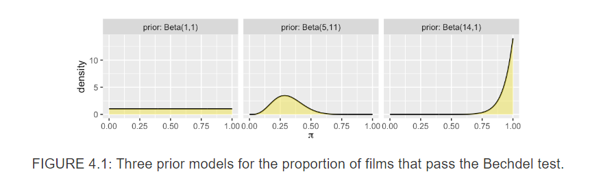
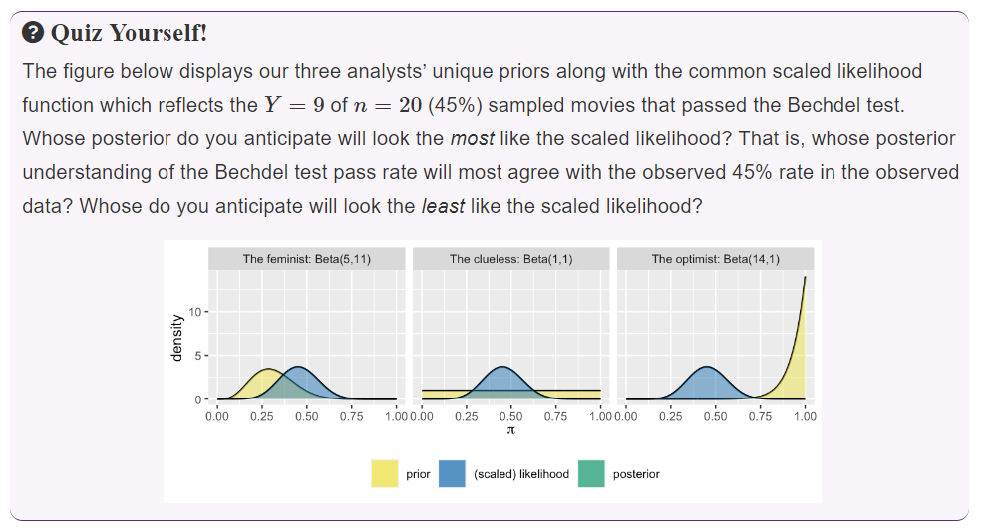
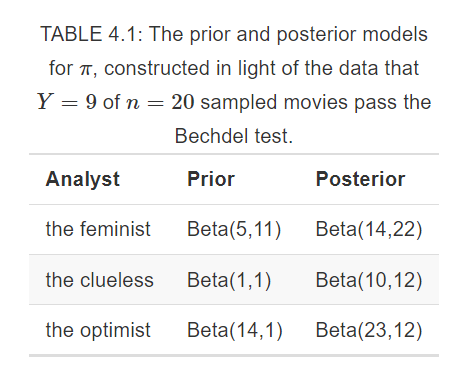
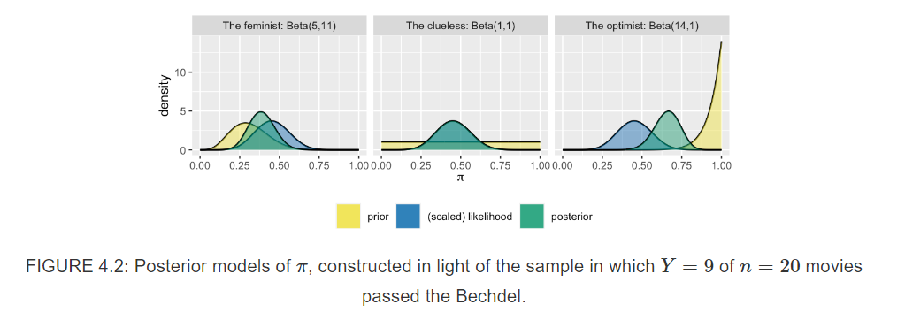
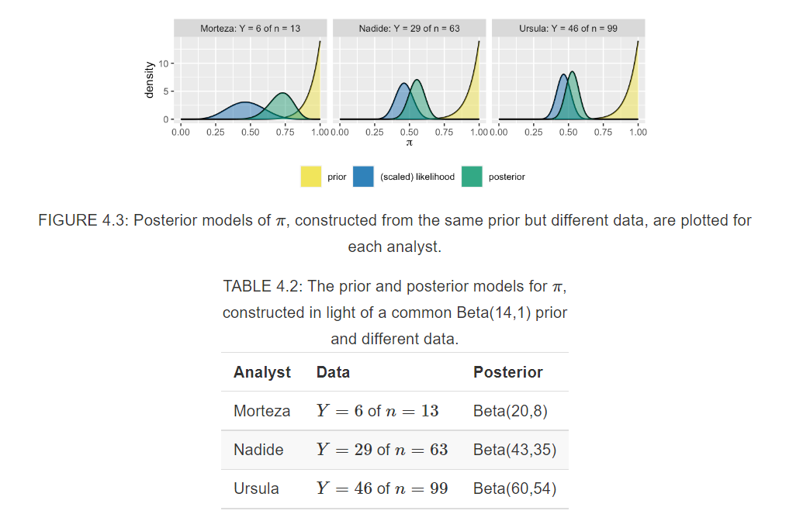
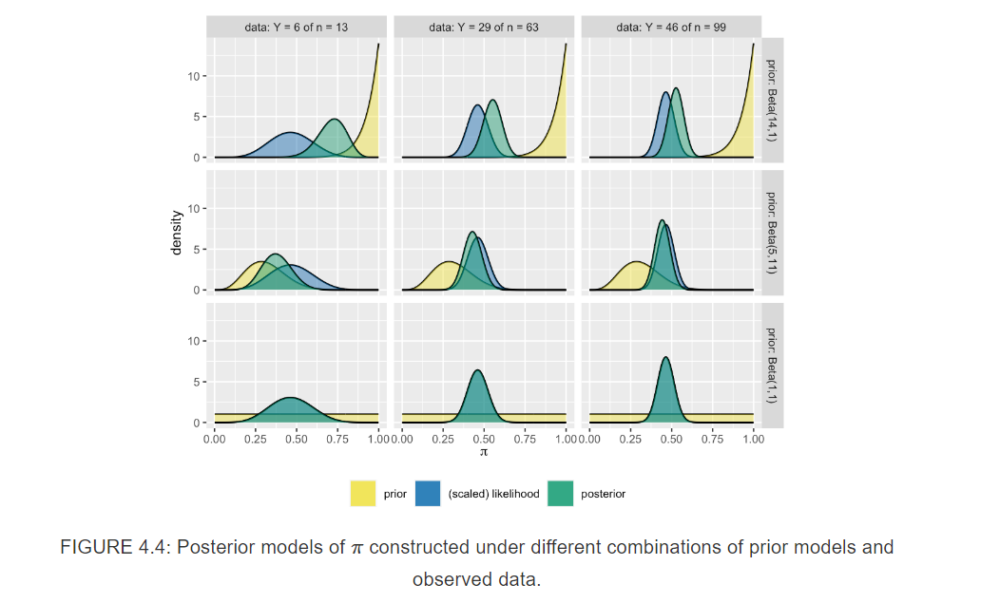

# Balance and Sequentiality in Bayesian Analyses

**Learning objectives:**

- **Explore the balanced influence of the prior and data on the posterior.** You will see how our choice of prior model, the features of our data, and the delicate balance between them can impact the posterior model.

- **Perform sequential Bayesian analysis.** You will explore one of the coolest features of Bayesian analysis: how a posterior model evolves as it’s updated with new data.

## Introductory Example 

- First, let's remember: 


- Three friends (**feminist, clueless, optimist**) discuss the proportion ($\pi$) of recent movies that pass the Bechdel test (representation of women in film).

- Which Beta prior corresponds to each of the friends? 



- The three friends agree to review a sample of *n* recet movies and record **Y**, the number of movies that pass the Bechdel test. 
- **Y** is the number of 'successes' in a fixed number of independent trials.

$$Y \sim {Bin}(n,\,\pi)$$
$$\pi \sim {Beta}(\alpha,\,\beta)$$

- Each analyst has their own unique posterior model of $\pi$.

$$\pi|(Y = y) \sim {Beta}(\alpha + y,\,\beta + n -y)$$

## Different priors, different posteriors   

- The more **certain** the prior information, the *smaller* the prior variability [Optimist friend]. 

> **Informative prior**
> 
> An informative prior reflects specific information about the unknown variable with high certainty, i.e., low variability.

- The more **vague** the prior information, the *greater* the prior variability [Clueless friend]. 

> **Vague prior**
> 
> A vague or diffuse prior reflects little specific information about the unknown variable. A flat prior, which assigns equal prior plausibility to all possible values of the variable, is a special case.

- How will their different priors influence the posterior conclusions of the friends? To answer this question, they collected some data! 

- Review 20 recent movies picked at random. 

```{r packages, echo=FALSE, message=FALSE, warning=FALSE}
# Load packages that will be used in this chapter
library(bayesrules)
library(tidyverse)
library(janitor)
library(gt)
```

```{r, echo=FALSE, results='asis'}
# Import data
data(bechdel, package = "bayesrules")

# Take a sample of 20 movies
set.seed(84735)

bechdel_20 <- bechdel %>% 
  sample_n(20)

bechdel_20 %>% 
  head(3) %>% 
  gt()%>% 
  tab_options(column_labels.font.weight = 'bold')
```

```{r}
bechdel_20 %>% 
  tabyl(binary) %>% 
  adorn_totals("row") %>% 
  gt() %>% 
  tab_options(column_labels.font.weight = 'bold')
```







## Different data, different posteriors 

- Now let's vary sample sizes. 


- The larger the sample size *n*, the more 'insistent' the likelihood function. 
- We see that the more insistent the likelihood, the more influence the data holds over the posterior. 



## Striking a balance between the prior and data 

- The grid of plots illustrates the balance that the posterior model strikes between the prior and data. Each row corresponds to a unique prior model and each column to a unique set of data.

- The likelihood’s insistence and, correspondingly, the data’s influence over the posterior increase with sample size *n*. 
- The influence of our prior understanding diminishes as we amass new data. Further, the rate at which the posterior balance tips in favor of the data depends upon the prior.
- Naturally, the more informative the prior, the greater its influence on the posterior.
- KEY UNDERSTANDING: no matter the strength of and discrepancies among their prior understanding of $\pi$, three analysts will come to a common posterior understanding in light of strong data.



```{r}
# Plot the Beta-Binomial model
plot_beta_binomial(alpha = 5, beta =11, y = 50, n = 99)
```

```{r}
# Obtain numerical summaries of the Beta-Binomial model
summarize_beta_binomial(alpha = 5, beta = 11, y = 50, n = 99) %>% 
  gt() %>% 
  fmt_number(columns = c(mean, mode, var, sd), 
             decimals = 2) %>% 
  tab_options(column_labels.font.weight = 'bold')
```


### Connecting concepts to theory

- Mathemagical! 

## Sequential analysis: evolving with data 

- We examined the increasing influence of the data and diminishing influence of the prior on the posterior as more and more data come in. Consider the nuances of this concept. The phrase “as more and more data come in” evokes the idea that data collection, and thus **the evolution in our posterior understanding, happens incrementally.**

> Sequential Bayesian analysis (aka Bayesian learning)
>
> In a sequential Bayesian analysis, a posterior model is updated incrementally as more data come in. With each new piece of data, the previous posterior model reflecting our understanding prior to observing this data becomes the new prior model.

-  Data order invariant. 

- The final posterior only depends upon the *cumulative* data. 

## Meeting Videos

### Cohort 1

`r knitr::include_url("https://www.youtube.com/embed/VCo4CZJNBAs")`

<details>
<summary> Meeting chat log </summary>

```
00:14:08	Brendan Lam:	eventually!
```
</details>

### Cohort 2

`r knitr::include_url("https://www.youtube.com/embed/xjkHan4vbfQ")`
