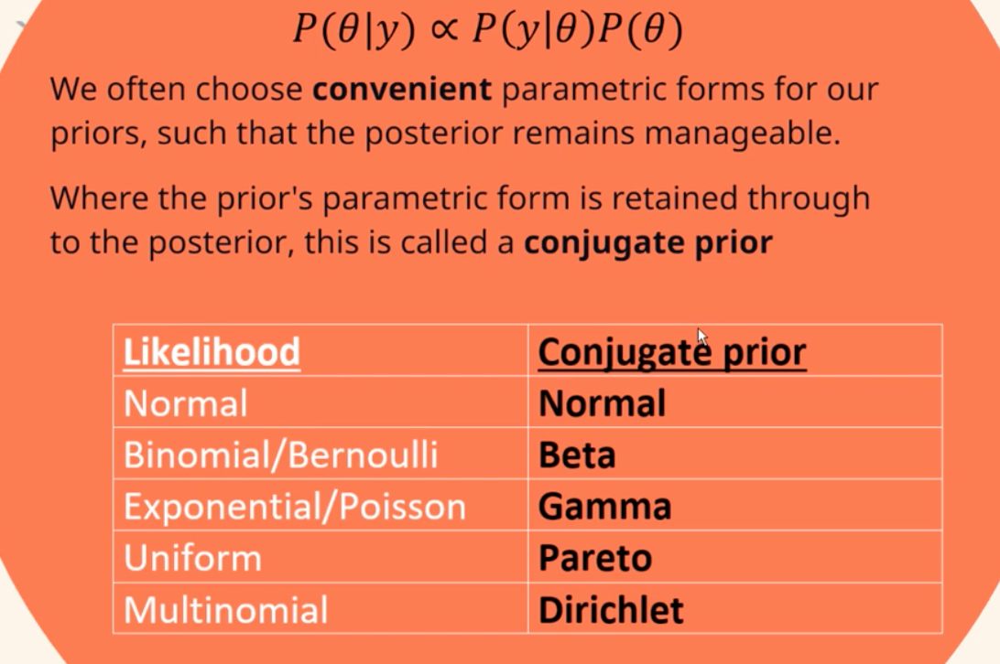

# Conjugate Families

**Learning objectives:**

- Practice building Bayesian models
- Familiarize yourself with conjugacy 


## Greek letters

- $\lambda$ = lambda

- $\mu$ = mu

- $\sigma$ = sigma

- $\tau$ = tau

- $\theta$ = theta

This our last chapter on Bayesian foundations!

## Revisiting choice of prior

- Flexibility 
- Computational ease: posterior easy to build
- Interpretability


### **Reminder** the Beta-Binomial Model:

1. Prior: $Beta (\alpha, \beta)$

2. Data model: $Y = y \quad for \quad Bin(n, \pi)$  

3. Posterior: $Beta(\alpha + y, \beta = n - y)$ 

## Joy!

Here are a couple of extra resources I found very interesting:

- [zedstatistics](https://www.youtube.com/watch?v=Pahyv9i_X2k)
- [Conjugate prior for a Binomial likelihood](https://www.youtube.com/watch?v=AHePwNKfPS8)

<center>

</center>


## Gamma-Poisson conjugate family 1/8

We are going to do a model to estimate the number of fraud risk phone call: 

### Prior: 

- rate $\tau \approx$ 5 number of phone call / day

- can range from 2-7

## Gamma-Poisson conjugate family 2/8

### Poisson **data** model:

$Y =$ number of *independent* event that occur in a fixed amount of time

$$Y|y \sim Pois(\tau) $$

Probability mass function:

$$ f(y|Y) =  \frac{\tau^ye^-\tau}{y!} \quad for y \in \{0, 1, 2, ...\} $$

(sum to 1)

$$E(Y|\tau) = Var(Y|\tau) = \tau $$

## Gamma-Poisson conjugate family 3/8

### Poisson pmfs with different $\tau$

```{r, fig.dim=c(8,4), echo=FALSE}
par(mfrow = c(1,3), mar = c(2,3,1,1))
x <- 0:12; f <- dpois(x, lambda = 1)
plot(x, f, type = "h", col = "blue", xlab = "", ylab="f(y)", main = "Pois(1)")
x <- 0:12; f <- dpois(x, lambda = 2)
plot(x, f, type = "h", col = "blue", xlab = "", ylab="f(y)",  main = "Pois(2)")
x <- 0:12; f <- dpois(x, lambda = 5)
plot(x, f, type = "h", col = "blue", xlab = "",ylab="f(y)",  main = "Pois(5)")
```

## Gamma-Poisson conjugate family 4/8

### Joint probability mass function

We have pmf for each day but if we want for $n$ day we need to use joint probably mass function. (product of every pmf) 

$$L(\tau|\overrightarrow{y}) = \frac{\tau^{\sum y_i  e^{-n\tau}}}{\prod_{i=n}^{n} y!}  \propto e^{-n\tau} \tau^{\sum y_i}$$ 

We just need : $n$ and $\sum y_i$

## Gamma-Poisson conjugate family 5/8

### Potential priors?

$\tau$ is *postif* and *continuous* 

We have 3 probability models : 

- Gamma : $f(\tau) \propto \tau^{s-1} e^{-r\tau}$

- Weibull : $f(\tau) \propto \tau^{s-1} e^{(-r\tau)^s}$

- F : $f(\tau) \propto \tau^{s/2 - 1} (1 + \tau) ^ -s$ 

Quiz! Which one ?

## Gamma-Poisson conjugate family 6/8

### Gamma prior : Gamma and Exponential models

$\tau$ continuous random variable but can only take + value

$$\tau \sim Gamma(s, r)$$

Probability density functions: 

$$f(\tau) = \frac{r^s}{\Gamma (s)} \tau^{s - 1} e^{-r\tau} \quad for \quad \tau > 0  $$ 
$$ E(\tau) = \frac{s}{r} ; Mode(\tau) = \frac{s - 1}{r} \quad for \quad s \geq 1; Var(\tau) = \frac{s}{r^2} $$ 

When s = 1 -> Exponential model = Gamma(1,r)

$$\tau \sim Exp(r)$$ 

## Gamma-Poisson conjugate family 6/n

### Quiz!

- Gamma when s > r ? 

- Gamma when s < r ?

- More variability in Gamma(20, 20) or Gamma(20, 100) ? 


dashed = modes

solid = means

## Gamma-Poisson conjugate family 7/8

### Applications! 

$$ E(\tau) = \frac{s}{r} \approx 5$$
-> we need $s = 5r$

Trial and error:

```{r}
bayesrules::plot_gamma(shape = 10, rate = 2)
```

Yeahhhh! we have a Prior!


## Gamma-Poisson conjugate family 8/8

### Gamma-Poisson conjugacy

Now need a posterior!

$$ \tau|\overrightarrow{y} \sim Gamma(s + \sum y_i, r +n)  $$
We have: Gamma(10,2) and as data: $\overrightarrow{y} = (6 + 2 + 2+ 1 )$ , $n = 4$


$$\sum_{i = 1}^{4} = 6 + 2 + 2 + 1 =11$$

$$\overline{y} = \frac{\sum_{i = 1}^{4}}{4} = 2.75$$


$$L(\tau|\overrightarrow{y}) =  \frac{\tau^ye^{-n\tau}}{y!}$$

$$L(\tau|\overrightarrow{y}) =  \frac{\tau^{11}e^{-4\tau}}{6!2!2!1!} \propto \tau^{11}e^{-4\tau}$$

```{r}
bayesrules::plot_poisson_likelihood(y = c(6, 2, 2, 1), lambda_upper_bound = 10) 
```


We have prior, data, likelihood -> posterior

$$Gamma(10, 2) \longrightarrow  Gamma(s + \sum y_i, r +n)$$ 

$$\tau|\overrightarrow{y} \sim Gamma(21, 6) $$

```{r}
bayesrules::plot_gamma_poisson(shape = 10, rate = 2, sum_y = 11, n = 4)
```


## Normal-Normal conjugate family

Let's start considering a case study. 

> Among all people who have a history of concussions, we are interested in $\mu$ the average volume (in cubic centimeters) of a specific part of the brain: the hippocampus.

What we know so far:

- Both halves of the adults' hippocampus have a volume between 3.0 and 3.5 $cm^3$.

- Total hippocampal volume of both sides of the brain is between 6 and 7 $cm^3$

Our starting hypotheses are:

- $H_0$: $\mu$ is between 6 and 7 $cm^3$ with an average of 6.5. 
- $n=25$
- suppose $Normal$ prior
- use the $Normal-Normal$ Bayesian model

Since hippocampal volumes, our $Y_i$, are measured on a continuous scale, there are many possible common models of the variability:

- Beta --> but it is not good as it assumes $Y_i \epsilon[0,1]$, our $\mu$ is 6.5$cm^3$
- Exponential
- Gamma
- **Normal** --> hippocampal symmetrically or Normally distributed around some global average
- F
- ...etc


## Normal Model

$$Y \sim N(\mu,\sigma^2)$$

$$f(y)=\frac{1}{\sqrt{2 \pi \sigma^2}}exp\begin{bmatrix}
-\frac{(y-\mu)^2}{2\sigma^2/n}\end{bmatrix}$$ for $y \epsilon (-\infty,\infty)$


      plot_normal(mean,sd)


```{r}
library(bayesrules)
```


### Prior X Likelihood = Posterior

$f(\vec{y}|\mu)$ x $L(\mu|\vec{y})$ 


Starting from the **prior** model:

$$\mu \sim N(6.5,0.4^2)$$

We are considering the adults with experience of concussion, in the `football` dataset.

```{r message=FALSE,warning=FALSE}
library(tidyverse)
football%>%head
```
```{r}
football%>%count(group)
```


Let's see the mean:
```{r}
football%>%
  filter(group == "fb_concuss")%>%
  summarise(mean=mean(volume),sd=sd(volume))
```
```{r}
concussion_subjects <- football%>%
  filter(group == "fb_concuss")

concussion_subjects%>%
  ggplot(aes(x = volume)) + 
  geom_density()
```

$$L(y|\vec{y}) \propto exp \begin{bmatrix}
-\frac{(5.735-\mu)}{2(0.5^2/25)}\end{bmatrix}$$

```{r}

plot_normal_likelihood(y = concussion_subjects$volume, sigma = 0.5)
```
```{r}
plot_normal_normal(mean = 6.5, sd = 0.4, sigma = 0.5,
                   y_bar = 5.735, n = 25)
```
```{r}
summarize_normal_normal(mean = 6.5, sd = 0.4, sigma = 0.5,
                        y_bar = 5.735, n = 25)
```

## Why no simulation in this chapter? 

Hard to do!

We moved from sample size 1 -> $n$


## Critiques of conjugate family

- less flexible in selection the prior

- some does not allow flat prior


## Summary

- conjugate priors are easy to compute/derive, interpretable

- Beta-Binomial: data Y is the number of successes in a set of $n$ trials 

- Gamma-Poisson: Y is a count with no upper limit

- Normal-Normal: Y is continuous 


## Meeting Videos

### Cohort 1

`r knitr::include_url("https://www.youtube.com/embed/8ley3O5O070")`


### Cohort 2

`r knitr::include_url("https://www.youtube.com/embed/DwNDC_QWgag")`


### Cohort 3

`r knitr::include_url("https://www.youtube.com/embed/zva5guIAOic")`


### Cohort 4

`r knitr::include_url("https://www.youtube.com/embed/URL")`

<details>
<summary> Meeting chat log </summary>

```
LOG
```
</details>
