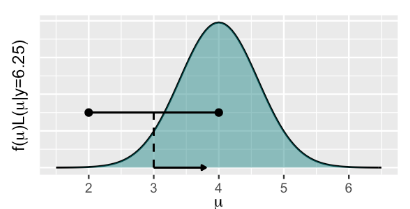
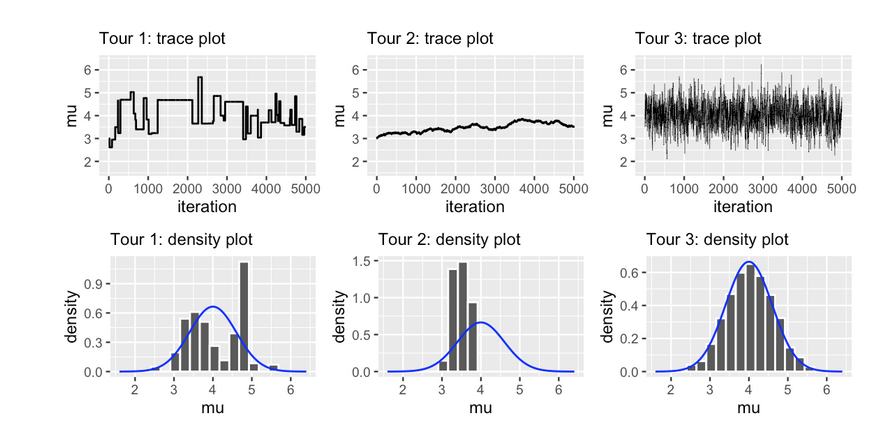

# MCMC under the Hood

**Learning objectives:**

- **Conceptual understanding** of how Markov chain algorithms work  
- Explore **Metropolis-Hastings** algorithm
- Implement it with the Normal-Normal  

## The big idea 1/2

We are going to use a Normal-Normal model: 

$$ Y|\mu \sim Norm(\mu, 0.75^2)$$

$$ \mu \sim Norm(0, 1^2) $$ 

Observed outcome 6.25:

$$ \mu|(Y = 6.25) \sim Norm(4, 0.6^2)$$

Main idea: chain need to spend more time around $\mu$ value. Remember $\mu^{i+1}$ is dependant of $\mu^{i}$.

How are we going to visit every part of the posterior dustribution: 

1. **step 1** : propose a random location $\mu'$ (I prefer $\mu_{proposal}$) for the nex stop 

2. **step 2** : Decide whether to:   
    * go to the proposed location:  $\mu_{proposal} = \mu^{i+1}$ 
    * stay at the current location: $\mu = \mu^{i+1}$

Monte Carlo algorithm: 

- step 1 propose location: draw $\mu$ from posterior model with $pdf \quad f(\mu|y)$ 

- step 2 : Go there

## The big idea 2/2

But we are using MCMC to approximate this pdf (so we can't sample it). 

For we are going to use two *tricks*: 

We do *know* that $f(u|y = 6.25) \propto f(\mu)L(u|y = 6.25)$

For step 1 we can use an other model or distribution to generate *proposals*



$$ \mu_{proposal}|\mu \sim Unif(\mu - w, \mu, + w)   $$

with pdf: 

$$ q(\mu'|\mu) = \frac{1}{2 w}$$

This give us a way for doing step1!

## The Metropolis-Hastings algorithm

* step 1: ok : $q(\mu_{proposal}|\mu)$

* step 2: 
    - we are going to calculate an **acceptance probability**:
    
    $$\alpha = \{1, \frac{f(\mu_{proposal}) L(\mu_{proposal}|y) q(\mu|\mu_{proposal})}{f(\mu)L(\mu|y) q(\mu_{proposal|\mu})} \}$$

Because the Uniform proposal model is symmetric:

$$ q(\mu_{proposal}|\mu) = q(\mu|\mu_{proposal})$$

Then after multiplying by $f(y)$ we have now: 

$$ \alpha = min\{1, \frac{f(\mu_{proposal}|y)}{f(\mu|y)} \} $$ 

This ration is equivalent to the unnormalized posterior. 

Two scnearios: 

- Scenario 1:  $f(\mu_{proposal}|y) \geq f(\mu|y)$ -> $\alpha = 1$ we are moving 

- Scenario 2: $f(\mu_{proposal}|y) < f(\mu|y) $ then we move according to the probability $\alpha$ 

```{r}
one_mh_iteration <- function(w, current){
 # STEP 1: Propose the next chain location
 proposal <- runif(1, min = current - w, max = current + w)
  
 # STEP 2: Decide whether or not to go there
 proposal_plaus <- dnorm(proposal, 0, 1) * dnorm(6.25, proposal, 0.75)
 current_plaus  <- dnorm(current, 0, 1) * dnorm(6.25, current, 0.75)
 alpha <- min(1, proposal_plaus / current_plaus)
 next_stop <- sample(c(proposal, current), 
                     size = 1, prob = c(alpha, 1-alpha))
  
 # Return the results
 return(data.frame(proposal, alpha, next_stop))
}

set.seed(8)
one_mh_iteration(w = 1, current = 3)
```

## Implementing the Metropolis-Hastings 

```{r}
mh_tour <- function(N, w){
  # 1. Start the chain at location 3
  current <- 3

  # 2. Initialize the simulation
  mu <- rep(0, N)

  # 3. Simulate N Markov chain stops
  for(i in 1:N){    
    # Simulate one iteration
    sim <- one_mh_iteration(w = w, current = current)
    
    # Record next location
    mu[i] <- sim$next_stop
    
    # Reset the current location
    current <- sim$next_stop
  }
  
  # 4. Return the chain locations
  return(data.frame(iteration = c(1:N), mu))
}
```


```{r}
library(ggplot2)
set.seed(84735)
mh_simulation_1 <- mh_tour(N = 5000, w = 1)
ggplot(mh_simulation_1, aes(x = iteration, y = mu)) + 
  geom_line()

ggplot(mh_simulation_1, aes(x = mu)) + 
  geom_histogram(aes(y = ..density..), color = "white", bins = 20) + 
  stat_function(fun = dnorm, args = list(4,0.6), color = "blue")
```
## Tuning the Metropolis-Hastings algorithm

### Quiz! 

w = 0.01 or w = 100, or w = 1



## A Beta-Binomial example

1 success in 2 trials

$$ Y|\pi = bin(2, \pi) $$

$$ \pi = Beta(2,3) $$

We are still playing "pretend"

We are moving for step 1 to an Uniform to a Beta model because we want $\pi$ to be [0,1]. And we will draw every step from this Beta model. -> change in step 1

$$\alpha = min \{1, \frac{f(\pi_{proposal}|y)q(\pi)}{f(\pi|y) q(\pi_{proposal})} \} $$ 

```{r}
one_iteration <- function(a, b, current){
 # STEP 1: Propose the next chain location
 proposal <- rbeta(1, a, b)
  
 # STEP 2: Decide whether or not to go there
 proposal_plaus <- dbeta(proposal, 2, 3) * dbinom(1, 2, proposal)
 proposal_q     <- dbeta(proposal, a, b) # <- new
 current_plaus  <- dbeta(current, 2, 3) * dbinom(1, 2, current)
 current_q      <- dbeta(current, a, b) # <- new
 alpha <- min(1, proposal_plaus / current_plaus * current_q / proposal_q)
 next_stop <- sample(c(proposal, current), 
                     size = 1, prob = c(alpha, 1-alpha))
  
 return(data.frame(proposal, alpha, next_stop))
}

```


```{r}
betabin_tour <- function(N, a, b){
  # 1. Start the chain at location 0.5
  current <- 0.5

  # 2. Initialize the simulation
  pi <- rep(0, N)
  
  # 3. Simulate N Markov chain stops
  for(i in 1:N){    
    # Simulate one iteration
    sim <- one_iteration(a = a, b = b, current = current)
    
    # Record next location
    pi[i] <- sim$next_stop
    
    # Reset the current location
    current <- sim$next_stop
  }
  
  # 4. Return the chain locations
  return(data.frame(iteration = c(1:N), pi))
}
```

## Why the algorithm works 

If the algorithm works : 

$$\frac{\mu \rightarrow \mu_{proposa}}{\mu_{proposal} \rightarrow \mu} = \frac{ f(\mu_{proposal}|y)}{f(\mu|y)}$$

## Chapter summary 

1. Step 1 Propose a new chain location by drawing from a proposal pdf which is perhaps dependent upon the current location

2. Determine whether accept the proposal: depends on how favorable its posterior plausibility is relative to the posterior plausibility of the *current location*


## Meeting Videos

### Cohort 1

`r knitr::include_url("https://www.youtube.com/embed/i1bA54EgaXk")`

<details>
<summary> Meeting chat log </summary>

```
00:00:12	Federica Gazzelloni:	Hello!
00:58:29	olivier leroy:	while (count_accept < M)
{
  count_draw <- count_draw + 1
un_runif <- runif(1)
  k <- rbinom(prob = un_runif,
              size = 10,
              n = 1)
  if(k == kobs) {
    count_accept <- count_accept + 1
    post[count_accept] <- un_runif  
  }         
}

01:04:14	olivier leroy:	https://www.youtube.com/watch?v=Qqz5AJjyugM&list=PLDcUM9US4XdMROZ57-OIRtIK0aOynbgZN&index=8&pp=sAQB
```
</details>

### Cohort 2

`r knitr::include_url("https://www.youtube.com/embed/LcDzmgDmWlU")`
