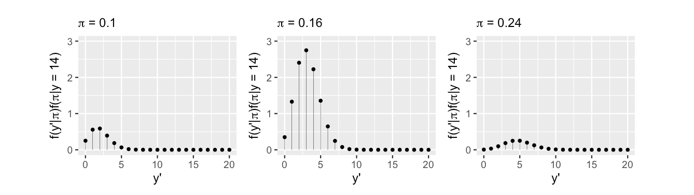
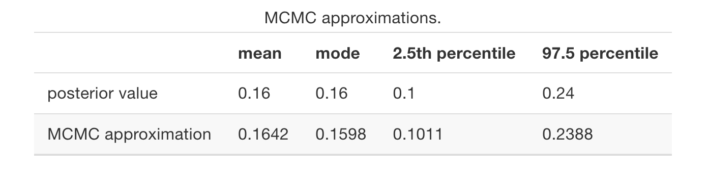

# Posterior Inference & Prediction

**Learning objectives:**

*Tasks in posterior analysis*

- estimation
- hypothesis testing
- prediction


## Introduction

> What are the chances that this modern artist is Gen X or even younger, i.e., born in 1965 or later?

<center>


</center>

<center>
**“modern” art doesn’t necessarily mean “new” art**
</center>


Speculating assumptions:

> major modern art museums disproportionately display artists born before 1965.

- $n=100$ artists

- $\pi$ is the proportion of artists represented in major U.S. modern art museums that are Gen X or younger, it most likely falls below 0.5.

- $Beta(4,6)$ is the prior model for $\pi$
```{r echo=TRUE,message=FALSE,warning=FALSE}
library(bayesrules)
library(tidyverse)
```

```{r echo=FALSE}
plot_beta_binomial(alpha = 4, beta = 6, y = 14, n = 100)
```

We use a dataset in the {bayesrules} package which contains data made available by MoMA.
```{r comment=""}
data("moma_sample")
moma_sample%>%head
```

`genx` are artists 14 or younger:
```{r}
moma_sample %>%
  count(genx)%>%
  mutate(prop=n/sum(n))
```

We use a **Beta-Binomial framework** as $Y$ (genx) follows a **Binomial model**.

$$Y|\pi \sim Bin(100,\pi)$$
$$\pi \sim Beta(4,6)$$

The posterior distribution is obtained:

$\alpha=4$ set to this value
$\beta=6$

$$\pi|(Y=y) \sim Beta(\alpha + \beta, \beta +n-y)$$

$$\pi|(Y=14) \sim Beta(18,92)$$

**Tasks in posterior analysis**: 

- estimation
- hypothesis testing
- prediction.

## Posterior estimation

The posterior model we have just estimated is an estimate of $\pi$.

```{r echo=TRUE,message=FALSE,warning=FALSE}
library(patchwork)
a <- plot_beta(18,92,mean = TRUE) + xlim(0,0.6) +ylim(0,12.5)
b <- plot_beta(4,16,mean = TRUE)+ xlim(0,0.6) +ylim(0,12.5)
(a|b) & labs(y="Density") &
  theme_bw() & theme(legend.position = "none")
```

```{r}
qbeta(c(0.025, 0.975), 18, 92)
```

## Posterior hypothesis testing

Hypothesis testing:

$$H_0: \pi \geqslant 0.2$$
$$H_a: \pi < 0.2$$


**One-sided tests**

To evaluate exactly how plausible it is that $\pi<0.2$:

- calculate the posterior probability 

$$P(\pi < 0.2|Y=14)$$

```{r}
pbeta(0.20, 18, 92)
```

```{r echo=FALSE}
plot_beta(18,92)+
  xlim(0,0.3)+
  geom_segment(x=0.2,xend=0.2,y=0,yend=6)
```

$$P(H_0|Y=14)=0.151$$
$$P(H_a|Y=14)=0.849$$

$$\text{posterior odds}=\frac{P(H_a|Y=14)}{P(H_0|Y=14)} \approx 5.62$$
```{r}
pbeta(0.20, 18, 92) / (1 - pbeta(0.20, 18, 92))
```


$$\text{prior odds}=\frac{P(H_a)}{P(H_0)} \approx 0.093$$
```{r}
pbeta(0.20, 4, 6) / (1 - pbeta(0.20, 4, 6))
```

$$\text{Bayes Factor}=\frac{\text{posterio odds}}{\text{prior odds}}$$

```{r}
BF <- (pbeta(0.20, 18, 92) / (1 - pbeta(0.20, 18, 92))) / (pbeta(0.20, 4, 6) / (1 - pbeta(0.20, 4, 6)))
BF
```

$$BF=\left\{\begin{matrix}
 1  & H_a\text{constant} \\ 
 >1 &  H_a\text{increased} \\
 <1 &  H_a\text{decreased} \\
\end{matrix}\right.$$

**Two-sided tests**

> There’s not one recipe for success

$$H_0: \pi = 0.3$$
$$H_a: \pi \neq 0.3$$


## Posterior prediction

> What number would you predict are done by artists that are Gen X or younger?

**Predict** the outcome of new data $Y'$

- Sampling variability in the data
- Posterior variability in $\pi$

Generally, greater $\pi$ is, the greater $Y'$ tends to be.


$$f(y'|y)= \int{f(y'|\pi)f(\pi|y)d\pi}$$


## Posterior analysis with MCMC

Markov chains of $\pi$ for 10,000 iterations each.


### Posterior simulation
```{r results='hide',cache=TRUE,echo=TRUE,message=FALSE,warning=FALSE}
library(rstan)
# STEP 1: DEFINE the model
art_model <- "
  data {
    int<lower = 0, upper = 100> Y;
  }
  parameters {
    real<lower = 0, upper = 1> pi;
  }
  model {
    Y ~ binomial(100, pi);
    pi ~ beta(4, 6);
  }
"

# STEP 2: SIMULATE the posterior
art_sim <- stan(model_code = art_model, 
                data = list(Y = 14), 
                chains = 4,
                iter = 5000*2, 
                seed = 84735)
```

```{r echo=TRUE,message=FALSE,warning=FALSE}
library(bayesplot)
# Parallel trace plots & density plots
mcmc_trace(art_sim, pars = "pi", size = 0.5) + 
  xlab("iteration")

mcmc_dens_overlay(art_sim, pars = "pi")

# Autocorrelation plot
mcmc_acf(art_sim, pars = "pi")
```


```{r}
# Markov chain diagnostics
rhat(art_sim, pars = "pi")
neff_ratio(art_sim, pars = "pi")
```


### Posterior estimation & hypothesis testing

Combined 20,000 Markov chain values.

```{r echo=TRUE,message=FALSE,warning=FALSE}
# The actual Beta(18, 92) posterior
plot_beta(alpha = 18, beta = 92) + 
  lims(x = c(0, 0.35))

# MCMC posterior approximation
mcmc_dens(art_sim, pars = "pi") + 
  lims(x = c(0,0.35))
```


```{r echo=TRUE,message=FALSE,warning=FALSE}
library(broom.mixed)
tidy(art_sim, conf.int = TRUE, conf.level = 0.95)
```


```{r}
# Shade in the middle 95% interval
mcmc_areas(art_sim, pars = "pi", prob = 0.95)
```

```{r}
# Store the 4 chains in 1 data frame
art_chains_df <- as.data.frame(art_sim, pars = "lp__", include = FALSE)
dim(art_chains_df)
```

```{r}
# Calculate posterior summaries of pi
art_chains_df %>% 
  summarize(post_mean = mean(pi), 
            post_median = median(pi),
            post_mode = sample_mode(pi),
            lower_95 = quantile(pi, 0.025),
            upper_95 = quantile(pi, 0.975))
```


Calculate summary statistics directly from the Markov chain values. 

We can approximate the posterior probability
$$P(\pi < 0.20 | Y =14)$$

```{r echo=TRUE,message=FALSE,warning=FALSE}
library(janitor)
# Tabulate pi values that are below 0.20
art_chains_df %>% 
  mutate(exceeds = pi < 0.20) %>% 
  tabyl(exceeds)
```

Compare results




### Posterior prediction

Utilize the Markov chain values to approximate the posterior predictive model of $Y'$. Repeating previous assumptions (sampling and posterior variability) and using `rbinom()`, we obtain:


```{r}
# Set the seed
set.seed(1)

# Predict a value of Y' for each pi value in the chain
art_chains_df <- art_chains_df %>% 
  mutate(y_predict = rbinom(length(pi), 
                            size = 20, 
                            prob = pi))

# Check it out
art_chains_df %>% 
  head(3)
```

```{r}
# Plot the 20,000 predictions
ggplot(art_chains_df, aes(x = y_predict)) + 
  stat_count()
```

Approximate the posterior mean prediction $E(Y'|Y=14)$ and the posterior prediction interval for $Y'$.


```{r}
art_chains_df %>% 
  summarize(mean = mean(y_predict),
            lower_80 = quantile(y_predict, 0.1),
            upper_80 = quantile(y_predict, 0.9))
```


## Bayesian benefits

Compares Bayesian analyses to frequentist analyses.

## Meeting Videos

### Cohort 1

`r knitr::include_url("https://www.youtube.com/embed/akeNn1HBxYI")`

<details>
<summary> Meeting chat log </summary>

```
00:00:57	Olivier’s iPhone:	I am on mobile phone now, I will turn camera later!
01:08:30	Brendan Lam:	Learning Bayesian Stats Podcast: https://podcasts.google.com/feed/aHR0cHM6Ly9mZWVkcy5jYXB0aXZhdGUuZm0vbGVhcm5iYXllc3N0YXRzLw?sa=X&ved=0CAMQ4aUDahcKEwj45ff4opz5AhUAAAAAHQAAAAAQAQ&hl=en-CA
01:14:30	Brendan Lam:	https://errorstatistics.com/
```
</details>


### Cohort 2

`r knitr::include_url("https://www.youtube.com/embed/n5QRu0q9p5M")`


### Cohort 3

`r knitr::include_url("https://www.youtube.com/embed/jInkta2vZnA")`


### Cohort 4

`r knitr::include_url("https://www.youtube.com/embed/URL")`

<details>
<summary> Meeting chat log </summary>

```
LOG
```
</details>
