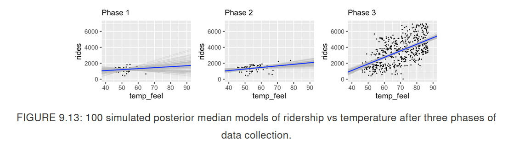

# Simple Normal Regression

**Learning objectives:**

- Building **simple linear regression model**
  
   * Interpret appropriate **prior models**  
   * **Simulate** posterior model of the regression parameters 
   * Utilize simulation result to
        - build posterior understanding of relationship between response ($Y$) and predictors ($X$) 
        - build posterior predictive models of $y$

## Begining of Unit 3!

**Congratulations on our progress!** 


## News terms 

$Y \rightarrow$ **Response variable**

$X_{i}, X_{2},  ..., X_{p} \rightarrow$ **Predictors**


- We want to analyze quantitative response : **Regression** 

- We want to analyze categorical response:  **Classification**

In this chapter we will go with the **Normal regression model**. 

Our *toy* example will come from a bike sharing service. We will try to understand the demand for it service. 

We want a model of the number of rides/day. Poisson model is not valid here because we do not have an equal mean and variance. Instead we are going to go with a **normal model**: 

$$Y_{i}|\mu, \sigma \overset{ind}{\sim} N(\mu, \sigma^2)  $$

$$ \mu \sim N(\theta, \tau^2) $$

$$ \sigma \sim some \; prior \; model $$

Can't we do better with a predictor? Here it will be the temperature in Fahrenheit.  

## Building the regression model

### Data model

We will have n data pairs of bike ridership ($Y$) and temperature ($X$) :

$$\{(Y_{1}, X_{1}), (Y_{2}, X_{2}), ..., (Y_{n}, X_{n}) \}$$

Here prior knowledge suggest positive linear relationship between ridership and temperature: the warmer it is, the more likely people are using bike share service.

We are now moving away from the **global mean** ($\mu$) to **local mean** ($\mu_{i}$, where $i$ is one day). If the relationship is linear : 

$$ \mu_{i} = \beta_{0} + \beta_{1}X_{i} $$

$\beta_{0}$ is the **intercept coefficent** but it is hard to interpret (would you rent bike when it is 0 degree F)

$\beta_{1}$ is the Temperature coefficient it indicates the *typical* change in ridership for every one unit increase in temperature. In case we have just one quantitative predictor it is called the *slope*.

We can *plunk* this assumption in our model : 

$$ Y_{i}| \beta_{0}, \beta_{1}, \sigma \overset{ind}{\sim} N(\mu_{i}, \sigma^2) \; with \quad \mu_{i} = \beta_{0} + \beta_{1}X_{i}  $$

As you can see $\sigma$ is now about variability from the **local mean**

#### Normal regression assumptions

- Structure of the data: accounting for $X$, $Y$ for one day is independent of an other day   

- Structure of the relationship: Y can be written as a **linear function** of predictor X : $\mu = \beta_{0} + \beta_{1}X$ 

- Structure of the variability: at any value of X, Y will vary **normaly** around $\mu$ with a consistent sd $\sigma$

### Specifying the priors

We are going to use `rstanarm` : Rstan + arm = applied regression models


#### Quiz!

What are our *parameters* ? 

<details class="details-example">
    <summary> Results</summary>
    $$\beta_{0}, \beta_{1}, \sigma$$
    
First assumption our *parameters* are **independent** 


$$ \beta_{0} \sim N(m_{0}, s^2_{0} ) $$

$$ \beta_{1} \sim N(m_{1}, s^2_{1} ) $$

$m_{0}, m_{1}, s_{0}, s_{1}$ are parameters of parameters so they are : **hyperparameters**

$$\sigma \sim Exp(l).$$ 

(no idea about the dot, probably = not 0)

### Putting it all together 

$$ Y_{i}| \beta_{0}, \beta_{1}, \sigma \overset{ind}{\sim} N(\mu_{i}, \sigma^2) \; with \quad \mu_{i} = \beta_{0} + \beta_{1}X_{i}  $$
$$ \beta_{0} \sim N(m_{0}, s^2_{0} ) $$

$$ \beta_{1} \sim N(m_{1}, s^2_{1} ) $$

$$\sigma \sim Exp(l).$$ 

</details>


> Model building one step at a time ! 

  1. Y is discret or continuous $\rightarrow$ appropriate model for data 
  
  2. Rewrite the mean of Y as a function of predictors X
  
  3. Identify unknow parameters in your model
  
  4.  what can be the value of those parameters for defining prior 


## Tuning prior models for regression parameters

a. An average temperature day (65, 70 degree F) in DC: 3000-7000 riders with around 5000

b. For every one degree increase you get +100 riders $\pm$ 80

c. at any given Temperature daily ridership vary with a sd of 1250 rides 

We will work with centered data $\beta_{0} \rightarrow \beta_{0c}$ because : 

- it is easier in this example 

- this is what `rstanarm` use


$$ Y_{i}| \beta_{0}, \beta_{1}, \sigma \overset{ind}{\sim} N(\mu_{i}, \sigma^2) \; with \quad \mu_{i} = \beta_{0} + \beta_{1}X_{i}  $$

$$ \beta_{0c} \sim N(5000, 1000^2 ) \tag{a.}$$

$$ \beta_{1} \sim N(100, 40^2 \tag{b.}) $$

$$\sigma \sim Exp(0.0008). \tag{c.}$$ 

The only hard part was using an eqution from chapter5: 

$$E(\sigma) = \frac{1}{l} = 1250$$ 

It is good to simulate this prior and see what they look like but we will do that in the part about rstanarm prior later.

## Posterior simulatiion 

Now we want to update our prior with data to get a posterior simulation! 

```{r, warning=FALSE}
# Load and plot data
library(bayesrules);library(ggplot2)
data(bikes)
ggplot(bikes, aes(x = temp_feel, y = rides)) + 
  geom_point(size = 0.5) + 
  geom_smooth(method = "lm", se = FALSE)
```
I am saving you from the triple integrals in the denominator of p 220 and we are jumping strait into MCMC!

### Simulation via rstanarm 

```{r, eval=FALSE }
bike_model <- rstanarm::stan_glm(
                      # data information
                       rides ~ temp_feel, # <- using a variation of the formula syntax ?
                       data = bikes, 
                       family = gaussian, # <- we assume normal data 
                       # Priors information 
                       prior_intercept = normal(5000, 1000), # normal diff de rnorm
                       prior = normal(100, 40), 
                       prior_aux = exponential(0.0008), #notice the aux for auxiliary more after
                       # MCMC information
                       chains = 4, iter = 5000*2, seed = 84735)
```


```{r, eval=FALSE }
# STEP 1: DEFINE the model
stan_bike_model <- "
  data {
    int<lower = 0> n;
    vector[n] Y;
    vector[n] X;
  }
  parameters {
    real beta0;
    real beta1;
    real<lower = 0> sigma;
  }
  model {
    Y ~ normal(beta0 + beta1 * X, sigma);
    beta0 ~ normal(-2000, 1000);
    beta1 ~ normal(100, 40);
    sigma ~ exponential(0.0008);
  }
"

# STEP 2: SIMULATE the posterior
stan_bike_sim <- 
  rstan::stan(model_code = stan_bike_model, 
       # data is structured a bit differently 
       data = list(n = nrow(bikes), Y = bikes$rides, X = bikes$temp_feel), 
       # same MCMC
       chains = 4, iter = 5000*2, seed = 84735)
```

The model will return 5000 x nb of chains simulation of our parameters. Rstanarm will change their name: 

- $\beta_{0} \rightarrow (intercept)$ (I think it is $\beta_{0}$ and not $\beta_{0c}$)

- $\beta_{1} \rightarrow temp\_feel$

But $\sigma$ stay sigma. 


We need to check if the simulation went well for that we can?    

<details class="details-example">
    <summary> Stop teasing us! </summary>

[X] check the effective sample size: `neff_ratio`

[X] rhat 

[X] trace plot (*fuzzy moustach*)

[X] overlay the density of each chains

</details>

## Interpreting the posterior 

What we have is the density of each parameters. 

```{r, eval=FALSE}
# Posterior summary statistics
broom.mixed::tidy(bike_model, # it take our output from rstanarm::stan_glm
                  effects = c("fixed", "aux"), # fixed is regression coef et aux is auxiliary ie sigma
     conf.int = TRUE, conf.level = 0.80)
# A tibble: 4 x 5
  term        estimate std.error conf.low conf.high
  <chr>          <dbl>     <dbl>    <dbl>     <dbl>
1 (Intercept)  -2194.     362.    -2656.    -1732. 
2 temp_feel       82.2      5.15     75.6      88.8
3 sigma         1281.      40.7    1231.     1336. 
4 mean_PPD      3487.      80.4    3385.     3591. 
```

Here we can get the **posterior median relationship** :

$$ -2194.24 + 82.16X $$
If we want a bigger picture: 

```{r, eval=FALSE}
# Store the 4 chains for each parameter in 1 data frame
bike_model_df <- as.data.frame(bike_model)

# Check it out
nrow(bike_model_df)
[1] 20000
head(bike_model_df, 3)
  (Intercept) temp_feel sigma
1       -2657     88.16  1323
2       -2188     83.01  1323
3       -1984     81.54  1363


# and use add_fiited_draws() from tidybayes

# 50 simulated model lines
bikes %>%
  tidybayes::add_fitted_draws(bike_model, n = 50) %>%
  ggplot(aes(x = temp_feel, y = rides)) +
    geom_line(aes(y = .value, group = .draw), alpha = 0.15) + 
    geom_point(data = bikes, size = 0.05)
# I did not evaluate the code here 
# you should test with more than 50 lines
```

#### Quiz!

Do we have ample posterior evidence that there's a positive association between ridership and temperature ?

<details class="details-example">
    <summary> Stop teasing us! </summary>
    
- Visual evidence : 50 or more posterior scenarios that display positive relationship

- Numerical evidence from CI: 80% CI for $\beta_{1}$ range from 75.6 to 88.8

- Numerical evidence from posterior probability

```{r, eval=FALSE}
# Tabulate the beta_1 values that exceed 0
bike_model_df %>% 
  mutate(exceeds_0 = temp_feel > 0) %>% 
  tabyl(exceeds_0)
# resuly
 exceeds_0     n percent
      TRUE 20000       1
```

</details>   

Finally we can also use `tidybayes::add_predicted_draws` to simulate X data set that make good use of plausible value of $\sigma$


## Posterior prediction

### Quiz!

> Suppose a weather report indicates that tomorrow will be a 75-degree day in D.C. What’s your posterior guess of the number of riders that Capital Bikeshare should anticipate?

<details class="details-example">
    <summary> Stop teasing us! </summary>

One option is 

$$ -2194.24 + 82.16 * 75 = 3967.76 $$ 

But this do not take into account : 

- Sampling variability  

- Posterior variability

</details>

The posterior predictive nodel take that into account. We have an overall chance to observe $Y_{new}$ and its parameters. We can *approximate* this posterior predictive model with our 20 000 sets of parameters.  

### Building a posterior predictive model

```{r, eval=FALSE}
# Predict rides for each parameter set in the chain
set.seed(84735)
predict_75 <- bike_model_df %>% 
  mutate(mu = `(Intercept)` + temp_feel*75, # <- our 75 degree
         y_new = rnorm(20000, mean = mu, sd = sigma)) # <- sampling var. 
head(predict_75, 3)
  (Intercept) temp_feel sigma   mu y_new
1       -2657     88.16  1323 3955  4838
2       -2188     83.01  1323 4038  3874
3       -1984     81.54  1363 4132  5196
```


Interesting point is `mu` ($\mu$) Vs. `y_new` ($Y_{new}$).

```{r, eval=FALSE}
# Construct 80% posterior credible intervals
predict_75 %>% 
  summarize(lower_mu = quantile(mu, 0.025),
            upper_mu = quantile(mu, 0.975),
            lower_new = quantile(y_new, 0.025),
            upper_new = quantile(y_new, 0.975))
  lower_mu upper_mu lower_new upper_new
1     3843     4095      1500      6482
```


$\mu$ is average in readership for 75 degree

$Y_new$ is for a specific day (with 75 degree)

=> More accuracy in predicting an *average* than an *unique* point!

### Posterior with rstanarm

We have done it from "scatch" but we can use `rstanarm::posterior_predict()`

```{r, eval=FALSE}
# Simulate a set of predictions
set.seed(84735)
shortcut_prediction <- 
  posterior_predict(bike_model, newdata = data.frame(temp_feel = 75))
```


## Sequential regression modeling

We can have our data that come in sequences: 

```{r, eval=FALSE}
phase_1 <- bikes[1:30, ]
phase_2 <- bikes[1:60, ]
phase_3 <- bikes
```



## Using default rstanarm priors

Authors recommend to you the default prior from rstanarm: 

```{r, eval=FALSE}
bike_model_default <- rstanarm::stan_glm(
  rides ~ temp_feel, data = bikes, 
  family = gaussian,
  # here very specific prior on sd
  prior_intercept = normal(5000, 2.5, autoscale = TRUE), # <- see autoscale arg.
  prior = normal(0, 2.5, autoscale = TRUE), 
  prior_aux = exponential(1, autoscale = TRUE),
  chains = 4, iter = 5000*2, seed = 84735)
```

```{r, eval=FALSE}
prior_summary(bike_model_default)
Priors for model 'bike_model_default' 
------
Intercept (after predictors centered)
  Specified prior:
    ~ normal(location = 5000, scale = 2.5)
  Adjusted prior:
    ~ normal(location = 5000, scale = 3937)

Coefficients
  Specified prior:
    ~ normal(location = 0, scale = 2.5)
  Adjusted prior:
    ~ normal(location = 0, scale = 351)

Auxiliary (sigma)
  Specified prior:
    ~ exponential(rate = 1)
  Adjusted prior:
    ~ exponential(rate = 0.00064)
------
See help('prior_summary.stanreg') for more details
```

It enforce **weakly informative priors** using the **scale** of the data. 

```{r, echo=FALSE, out.width="50%", fig.align = "center", fig.show='hold', fig.cap="Fig9.5 and 9.14 from Bayes Rules!"}
knitr::include_graphics(
  c("image/fig9.5.png",
    "image/fig9.14.png")
)
```

## Summary 

- Build a simple Bayesian Normal regression with reesponse and predictor quantitative 

- We noved fron global mean to local mean with the help of linear dependence


1. Build models

    - data model
    - priors models
    
2. Tuning priors models fro regressions parameters

    - rstanarm::stanglm(autoscale = TRUE)
    - rstantools::prior_summary()

3. Posterior simulation 

    a. Simulation

      - rstanarm::stan_glm()
      - rstan::stan()
    
    b. Check the simulation

      - bayesplot::neff_ratio()
      - rstan::rhat()
      - bayesplot::mcmc_trace()
      - bayesplot::mcmc_dens_overlay()
    
4.  Interpreting the posterior

      - broom.mixed::tidy()
      - tidybayes::add_fitted_draws()
      - tidybayes::add_predicted_draws()

5. Posterior predictions

    a. By hand (dplyr mutate and summarize)
    b. `rstanarm::posterio_predict()` + `rstantools::posterior_interval()`  

## Resources: 

- [Rstanarm vignette](https://mc-stan.org/rstanarm/articles/)

## Meeting Videos

### Cohort 1

`r knitr::include_url("https://www.youtube.com/embed/9n7IX3Y-6zw")`

### Cohort 2

`r knitr::include_url("https://www.youtube.com/embed/URL")`

<details>
<summary> Meeting chat log </summary>

```
LOG
```
</details>
