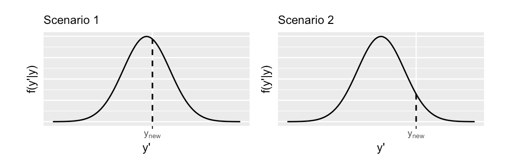

# Evaluating Regression Models


**Learning objectives:**

- Determine whether a model is fair
- Determine how wrong a model is
- Determine our model’s posterior predictive accuracy

---


## More question to ask

When we look at the Bayesian model results, it might be important to investigate a bit more about:

- How was the data collected?
- By whom and for what purpose was the data collected?
- How might the results of the analysis, or the data collection itself, impact individuals and society?
- What biases might be baked into this analysis?

```{r 10.1, echo=FALSE, fig.cap="Credits: https://godcgo.com/a-bike-friendly-washington-dc/"}

```


## Verifying Normal regression assumptions

**Assumption 1**: Structure of the data

- independency

**Assumption 2**: Structure of the relationship

- linearity 

**Assumption 3 **: Structure of the variability

- normality

---

Our model-case is made of:

- number of Capital Bikeshare rides: $Y_{i}$
- temperature on day $i$: $X_{i}$

```{r 10.2, echo=FALSE, fig.cap="Credits: dezeen.com"}

```

Starting from a Regression Model:

$$ Y_{i} = \beta_{0} + \beta_{1}X_{i} $$

We look for an approximation of the real mean value: estimate mean value

$$Y_{i} \approx\mu_{i}$$
$$ \mu_{i} = \beta_{0} + \beta_{1}X_{i} $$

> "...To turn this into a Bayesian model, we must incorporate prior models for each of the unknown regression parameters...(ct.9.1.2)"

with this model parameters:

$$ Y_{i}| \beta_{0}, \beta_{1}, \sigma \overset{ind}{\sim} N(\mu_{i}, \sigma^2) \; with \quad \mu_{i} = \beta_{0} + \beta_{1}X_{i}  $$

we expect some good results as we consider 500 daily observations within the two-year period.

The response variable **ridership** $Y$ is likely to be correlated over time with other features such as **temperature** $X$.

> "...today’s ridership likely tells us something about tomorrow’s ridership. Yet much of this correlation, or dependence, can be explained by the time of year and features associated with the time of year..."


> "...knowing the temperature on two subsequent days may very well “cancel out” the time correlation in their ridership data..."


We are tempted to conclude:

- the temperatures in one location are independent of those in neighboring locations,
- the temperatures in one month don’t tell us about the next.


```{r 10.3,echo=FALSE, fig.cap="Assumption1"}
DiagrammeR::grViz("
  digraph thinking_bayesian{
  
  # node statement
  node [shape = oval,width=0.2]
  a [label = 'Assumption 1']
  b [label = 'independence']
  # edge statement
  a -> b}")
```
**It’s reasonable to assume that, in light of the temperature $X$, ridership data $Y$ is independent from day to day.**


We are looking for a **centered** value of the **intercept**:

$$ \beta_{0c} \sim N(m_{0}, s^2_{0})= N(5000, 1000^2 ) \tag{a.}$$


$$ \beta_{1} \sim N(m_{1}, s^2_{1}) = N(100, 40^2 \tag{b.}) $$
$$ \sigma\sim Exp(l) = Exp(0.0008 \tag{c.}) $$


```{r 10.4,eval=T, message=FALSE, warning=FALSE, include=FALSE, paged.print=FALSE}
library(bayesrules)
library(tidyverse)
library(bayesplot)
library(rstanarm)
```

```{r 10.5}
data(bikes)
```


```{r 10.6,echo=FALSE}
bikes%>%select(date,rides,temp_feel)%>%head
```

---

To evaluate **assumptions 2** and **3** we conduct a **posterior predictive check**. 

Our first look was at the relationship between **rides and temperature**, and so at the consistency of the distribution.
```{r 10.7,echo=FALSE, fig.cap="Assumption 2 and 3"}
DiagrammeR::grViz("
  digraph thinking_bayesian{
  
  # node statement
  node [shape = oval,width=0.2]
  a [label = 'Assumption 2']
  b [label = 'Assumption 3']
  c [label = 'linearity']
  d [label = 'normality']
  # edge statement
  a -> c
  b -> d}")
```

```{r 10.8,echo=FALSE, message=FALSE, warning=FALSE, paged.print=FALSE}
ggplot(bikes, aes(y = rides, x = temp_feel)) + 
  geom_point(size = 0.2) + 
  geom_smooth(method = "lm", se = FALSE)+
  labs(title="Rides vs Temperature")+
  ggthemes::theme_fivethirtyeight()
```

Given the combined model assumptions reasonable, the posterior model should be able to simulate ridership data very close to the original 500 rides observations.

```{r 10.9, message=FALSE, warning=FALSE, paged.print=FALSE,eval=FALSE}
bike_model <- rstanarm::stan_glm(
                       rides ~ temp_feel, 
                       data = bikes, 
                       family = gaussian, 
                       prior_intercept = normal(5000, 1000),
                       prior = normal(100, 40), 
                       prior_aux = exponential(0.0008),
                       chains = 4, iter = 5000*2, seed = 84735)
```


```{r 10.10.1, include=FALSE}
# saveRDS(bike_model,"data/10_bike_model.rds")
bike_model <- readRDS("data/10_bike_model.rds")
```


```{r 10.10}
bike_model_df <- as.data.frame(bike_model)
first_set <- head(bike_model_df, 1)
first_set
```


```{r 10.11}
beta_0 <- first_set$`(Intercept)`
beta_1 <- first_set$temp_feel
sigma  <- first_set$sigma

set.seed(84735)
one_simulation <- bikes %>% 
  mutate(mu = beta_0 + beta_1 * temp_feel,
         simulated_rides = rnorm(500, mean = mu, sd = sigma)) %>% 
  select(temp_feel, rides, simulated_rides)

one_simulation%>%head
```


```{r 10.12}
ggplot(one_simulation, aes(x = simulated_rides)) + 
  geom_density(color = "lightblue") + 
  geom_density(aes(x = rides), color = "darkblue")+
  labs(title="One posterior simulated dataset of ridership (light blue)\nalong with the actual observed ridership data (dark blue).")+
  ggthemes::theme_fivethirtyeight()+
  theme(plot.title = element_text(size=10))
```

**Posterior predictive check**

Use the `pp_check()` function from {bayesplot} package included in the {rstanarm} package. It compares the observed outcome variable y to simulated datasets from the posterior predictive distribution. 

```{r 10.13}
# Examine 50 of the 20000 simulated samples
pp_check(bike_model,nreps = 50) + 
  xlab("rides")+
  labs(title="50 datasets of ridership simulated from the posterior (light blue)\nalongside the actual observed ridership data (dark blue)")
```

So, in general to check the last two assumptions you should:

- Assume a different data structure
- Make a transformation

---

## How accurate are the posterior predictive models?

**Three approaches to evaluating predictive quality**

1.  Posterior predictive summaries

    * median absolute error (MAE)
    * scaled median absolute error
    * within_50 and within_95
 
```{r 10.14}
set.seed(84735)
prediction_summary(bike_model, data = bikes)
```

```{r 10.15}
set.seed(84735)
predict_75 <- bike_model_df %>% 
  mutate(mu = `(Intercept)` + temp_feel*75,
         y_new = rnorm(20000, mean = mu, sd = sigma))

# Plot the posterior predictive model
ggplot(predict_75, aes(x = y_new)) + 
  geom_density()+
  geom_vline(aes(xintercept = 6228))+
  labs(title="The posterior predictive model of ridership on October 22, 2012,\na 75-degree day. The actual Y = 6228 riders observed that day are\nmarked by the vertical line.")+
  ggthemes::theme_fivethirtyeight()+
  theme(plot.title = element_text(size=10))
```

```{r 10.16}
set.seed(84735)
predictions <- posterior_predict(bike_model, newdata = bikes)
dim(predictions)
```


```{r 10.17}
ppc_intervals(bikes$rides, yrep = predictions, x = bikes$temp_feel, 
              prob = 0.5, prob_outer = 0.95)+
  labs(title="The posterior predictive medians (light blue dots),\n50% prediction intervals (wide, short blue bars),\nand 95% prediction intervals (narrow, long blue bars)\nfor each day in the bikes dataset, along with the corresponding\nobserved data points (dark blue dots).")
```

 
2.  Cross-validation

To see how well our model generalizes to new data beyond our original sample, we can estimate these properties using cross-validation techniques.
  
  * Train the model
  * Test the model
  
```{r 10.18}
set.seed(84735)
cv_procedure <- prediction_summary_cv(model = bike_model, 
                                      data = bikes, 
                                      k = 10)
```
```{r 10.19}
cv_procedure$folds%>%head
```
  
```{r 10.20}
cv_procedure$cv
```

<br>

All we want is:
```{r 10.21,fig.cap="Two hypothetical posterior predictive pdfs for Y new, the yet unobserved ridership on a new day. The eventual observed value of y new, is represented by a dashed vertical line", echo=FALSE}

```


3.  Expected log-predictive density (ELPD)

**ELPD** measures the average log posterior predictive pdf, across all possible new data points. The higher the ELPD, the better. Higher ELPDs indicate greater posterior predictive accuracy when using our model to predict new data points.

The `loo()` function in the {rstanarm} package utilizes **leave-one-out cross-validation** to estimate the **ELPD** of a given model:

```{r 10.22}
model_elpd <- loo(bike_model)
model_elpd$estimates
```


### Improving posterior predictive accuracy

  * Collect more data
  * Use different or more predictors
  
  
---  
  
  
## How good is the MCMC simulation vs how good is the model?

1.  How well our MCMC simulation approximates the model?

2.  Does the model fit?

    * are the assumptions reasonable?
    * is the model fair?
    * does it produce good predictions?


---

## Extra resources:

[The Impact of Weather Conditions on Capital Bikeshare Trips](https://www.semanticscholar.org/paper/The-Impact-of-Weather-Conditions-on-Capital-Trips-Gebhart-Noland/318f13dfafa6fa12176e0b856bc141f675f17203)

---

## Meeting Videos

### Cohort 1

`r knitr::include_url("https://www.youtube.com/embed/URL")`

<details>
<summary> Meeting chat log </summary>

```
LOG
```
</details>
