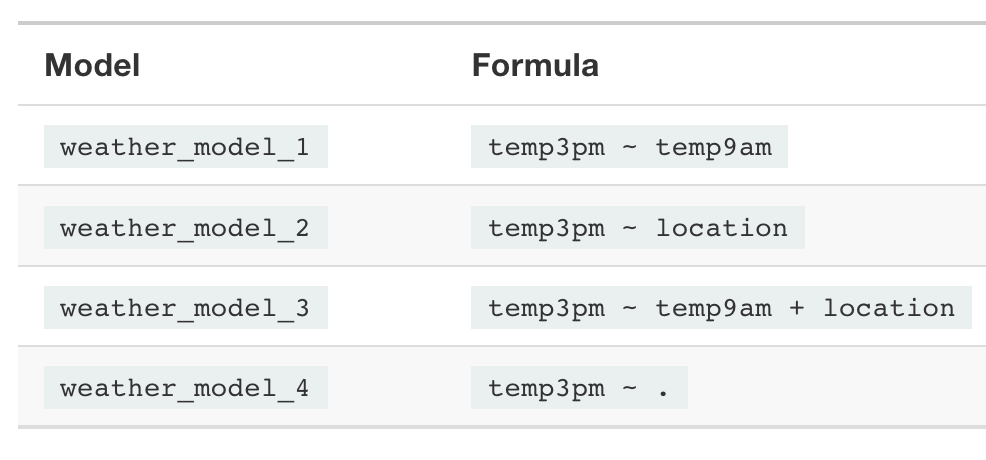

# Extending the Normal Regression Model

**Learning objectives:**

- How to extend Normal Regression Models using:

    - categorical predictors
    - more than one/two predictors
    - interaction terms

- How to compare model evaluations


## Extending the Normal Regression Model

```{r warning=FALSE,message=FALSE}
# Load some packages
library(bayesrules)
library(rstanarm)
library(bayesplot)
library(tidyverse)
library(broom.mixed)
library(tidybayes)

# Load the data
data(weather_WU)
weather_WU %>% 
  count(location)
```

```{r}
weather_WU <- weather_WU %>% 
  select(location, 
         windspeed9am, humidity9am, pressure9am, 
         temp9am, temp3pm)

weather_WU%>%head
```

A typical afternoon temperature is somewhere between 15 and 35 degrees Celsius.

```{r}
ggplot(weather_WU, 
       aes(x = temp9am, y = temp3pm)) +
  geom_point(size = 0.2)+
  geom_smooth(method="lm")
```

```{r}
(15+35)/2
```

$$\beta_{c0}\sim N(25,5^2)$$

```{r}
mean(weather_WU$temp3pm)
```

$$\beta_{1}\sim N(0,3.1^2)$$

```{r}
mean(weather_WU$temp9am);
sd(weather_WU$temp9am);
```

```{r results='hide'}
weather_model_1 <- stan_glm(
  temp3pm ~ temp9am, 
  data = weather_WU, 
  family = gaussian,
  prior_intercept = normal(25, 5),
  prior = normal(0, 2.5, autoscale = TRUE), 
  prior_aux = exponential(1, autoscale = TRUE),
  chains = 4, iter = 5000*2, seed = 84735)
```


```{r}
# Prior specification
prior_summary(weather_model_1)
```

```{r}
# MCMC diagnostics
mcmc_trace(weather_model_1, size = 0.1)
```

```{r}
mcmc_dens_overlay(weather_model_1)

```

```{r warning=FALSE,message=FALSE}
mcmc_acf(weather_model_1)
```
```{r}
neff_ratio(weather_model_1)
```


```{r}
rhat(weather_model_1)
```


```{r}
posterior_interval(weather_model_1, prob = 0.80)
```

```{r}
pp_check(weather_model_1)
```


## Utilizing a categorical predictor

```{r}
ggplot(weather_WU, aes(x = temp3pm, fill = location)) + 
  geom_density(alpha = 0.5)
```

```{r}
ggplot(weather_WU, aes(x=temp3pm , y=location)) + 
  geom_col()
```

```{r}
weather_WU%>%
  group_by(location)%>%
  reframe(avg=mean(temp3pm),sd=sd(temp3pm),)
```

```{r results='hide'}
weather_model_2 <- stan_glm(
  temp3pm ~ location,
  data = weather_WU, 
  family = gaussian,
  prior_intercept = normal(25, 5),
  
  prior = normal(0, 2.5, autoscale = TRUE), 
  prior_aux = exponential(1, autoscale = TRUE),
  
  chains = 4, iter = 5000*2, seed = 84735)
```


```{r}
# MCMC diagnostics
mcmc_trace(weather_model_2, size = 0.1)
```

```{r}
mcmc_dens_overlay(weather_model_2)
```

```{r}
mcmc_acf(weather_model_2)
```


```{r}
tidy(weather_model_2, effects = c("fixed", "aux"),
     conf.int = TRUE, conf.level = 0.80) %>% 
  select(-std.error)
```

```{r}
as.data.frame(weather_model_2) %>% 
  mutate(uluru = `(Intercept)`, 
         wollongong = `(Intercept)` + locationWollongong) %>% 
  mcmc_areas(pars = c("uluru", "wollongong"))
```

## Utilizing two predictors


What we know about **afternoon temperatures in Australia**:

- positively associated with morning temperatures
- tend to be lower in Wollongong than in Uluru


Now extend the model to:

> two-predictor model of 3 p.m. temperature using both temp9am and location


```{r}
ggplot(weather_WU, aes(y = temp3pm, 
                       x = temp9am, 
                       color = location)) + 
  geom_point() + 
  geom_smooth(method = "lm", se = FALSE)
```

```{r results='hide'}
weather_model_3_prior <- stan_glm(
  temp3pm ~ temp9am + location,
  data = weather_WU, 
  family = gaussian, 
  prior_intercept = normal(25, 5),
  prior = normal(0, 2.5, autoscale = TRUE), 
  prior_aux = exponential(1, autoscale = TRUE),
  chains = 4, 
  iter = 5000*2, 
  seed = 84735,
  prior_PD = TRUE)
```


### Simulate 100 datasets from the prior models

```{r warning=FALSE,message=FALSE}
set.seed(84735)
weather_WU %>%
  add_predicted_draws(weather_model_3_prior, n = 100) %>%
  ggplot(aes(x = .prediction, group = .draw)) +
    geom_density() + 
    xlab("temp3pm")
```

```{r warning=FALSE,message=FALSE}
weather_WU %>%
  add_fitted_draws(weather_model_3_prior, n = 100) %>%
  ggplot(aes(x = temp9am, 
             y = temp3pm, 
             color = location)) +
    geom_line(aes(y = .value, 
                  group = paste(location, .draw)))
```


Combine prior assumption with simulations, specifying

    prior_PD = FALSE

```{r results='hide'}
weather_model_3 <- update(weather_model_3_prior,
                          prior_PD = FALSE)
```


> Across all 100 scenarios, 3 p.m. temperature is positively associated with 9 a.m. temperature and tends to be higher in Uluru than in Wollongong.

```{r}
head(as.data.frame(weather_model_3), 6)
```

```{r message=FALSE,warning=FALSE}
weather_WU %>%
  add_fitted_draws(weather_model_3, n = 100) %>%
  ggplot(aes(x = temp9am, y = temp3pm, color = location)) +
    geom_line(aes(y = .value, group = paste(location, .draw)), alpha = .1) +
    geom_point(data = weather_WU, size = 0.1)
```

```{r}
# Posterior summaries
posterior_interval(weather_model_3, prob = 0.80, 
                   pars = c("temp9am", "locationWollongong"))
```

### Predict 3 p.m. temperature on specific days

```{r}
# Simulate a set of predictions
set.seed(84735)
temp3pm_prediction <- posterior_predict(
  weather_model_3,
  newdata = data.frame(temp9am = c(10, 10), 
                       location = c("Uluru", "Wollongong")))
```


```{r}
# Plot the posterior predictive models
mcmc_areas(temp3pm_prediction) +
  ggplot2::scale_y_discrete(labels = c("Uluru", "Wollongong")) + 
  xlab("temp3pm")
```
## Optional: Utilizing interaction terms

Predictors interaction of 3 p.m. temperature ($Y$) with location ($X_2$) and 9 a.m. humidity ($X_3$).

```{r}
ggplot(weather_WU, aes(y = temp3pm, 
                       x = humidity9am, 
                       color = location)) +
  geom_point(size = 0.5) + 
  geom_smooth(method = "lm", se = FALSE)
```

```{r results='hide'}
interaction_model <- stan_glm(
  temp3pm ~ location + humidity9am + location:humidity9am, 
  data = weather_WU, family = gaussian,
  prior_intercept = normal(25, 5),
  prior = normal(0, 2.5, autoscale = TRUE), 
  prior_aux = exponential(1, autoscale = TRUE),
  chains = 4, iter = 5000*2, seed = 84735)
```


```{r}
# Posterior summary statistics
tidy(interaction_model, effects = c("fixed", "aux"))
```

Simulations:
```{r}
weather_WU %>%
  add_fitted_draws(interaction_model, n = 200) %>%
  ggplot(aes(x = humidity9am, 
             y = temp3pm, 
             color = location)) +
    geom_line(aes(y = .value, group = paste(location, .draw)), alpha = 0.1)
```


## Dreaming bigger: Utilizing more than 2 predictors!

> To improve our understanding and posterior predictive accuracy of afternoon temperatures, we can incorporate more and more predictors into our model.


```{r}
weather_WU %>% 
  names()
```

```{r results='hide'}
weather_model_4 <- stan_glm(
  temp3pm ~ .,
  data = weather_WU, 
  family = gaussian, 
  prior_intercept = normal(25, 5),
  prior = normal(0, 2.5, autoscale = TRUE), 
  prior_aux = exponential(1, autoscale = TRUE),
  chains = 4, iter = 5000*2, 
  seed = 84735)
```


```{r}
# Confirm prior specification
prior_summary(weather_model_4)

```

```{r}
# Check MCMC diagnostics
mcmc_trace(weather_model_4)
```

```{r}
mcmc_dens_overlay(weather_model_4)
```

```{r}
mcmc_acf(weather_model_4)
```

```{r}
# Posterior summaries
posterior_interval(weather_model_4, prob = 0.95)
```


## Model evaluation & comparison


```{r}
library(patchwork)
# Posterior predictive checks. For example:
p1<- pp_check(weather_model_1)+labs(title="Model 1")
p2<- pp_check(weather_model_2)+labs(title="Model 2")
p3<- pp_check(weather_model_3)+labs(title="Model 3")
p4<- pp_check(weather_model_4)+labs(title="Model 4")

(p1|p2|p3|p4) +
  plot_layout(guides = "collect") &
  theme(legend.position = "bottom")
```

### Evaluating predictive accuracy using visualizations

```{r}
set.seed(84735)
predictions_1 <- posterior_predict(weather_model_1,
                                   newdata = weather_WU)

# Posterior predictive models for weather_model_1
ppc_intervals(weather_WU$temp3pm, 
              yrep = predictions_1, 
              x = weather_WU$temp9am, 
              prob = 0.5, 
              prob_outer = 0.95) + 
  labs(x = "temp9am", y = "temp3pm")
```


```{r}
set.seed(84736)
predictions_2 <- posterior_predict(weather_model_2,
                                   newdata = weather_WU)
# Posterior predictive models for weather_model_2
ppc_violin_grouped(weather_WU$temp3pm, 
                   yrep = predictions_2, 
                   group = weather_WU$location, 
                   y_draw = "points") + 
  labs(y = "temp3pm")
```

```{r}
set.seed(84737)
predictions_3 <- posterior_predict(weather_model_3,
                                   newdata = weather_WU)
# Posterior predictive models for weather_model_3
ppc_intervals_grouped(weather_WU$temp3pm, 
                      yrep = predictions_3, 
                      x = weather_WU$temp9am, 
                      group = weather_WU$location,
                      prob = 0.5, 
                      prob_outer = 0.95,
                      facet_args = list(scales = "fixed")) + 
  labs(x = "temp9am", y = "temp3pm")
```

## Evaluating predictive accuracy using cross-validation


```{r}
set.seed(84735)
prediction_summary_cv(model = weather_model_1, 
                      data = weather_WU, k = 10)
```


## Evaluating predictive accuracy using ELPD

```{r}
# Calculate ELPD for the 4 models
set.seed(84735)
loo_1 <- loo(weather_model_1)
loo_2 <- loo(weather_model_2)
loo_3 <- loo(weather_model_3)
loo_4 <- loo(weather_model_4)

# Results
c(loo_1$estimates[1], loo_2$estimates[1], 
  loo_3$estimates[1], loo_4$estimates[1])
```

```{r}
# Compare the ELPD for the 4 models
loo_compare(loo_1, loo_2, loo_3, loo_4)
```

### The bias-variance trade-off

Explore the bias-variance trade-off speaks to the performance of a model across multiple datasets:

- first simulate the posteriors for each model
- calculate raw and cross-validated posterior prediction summaries for each model

```{r}
# Take 2 separate samples
set.seed(84735)
weather_shuffle <- weather_australia %>% 
  filter(temp3pm < 30, 
         location == "Wollongong") %>% 
  sample_n(nrow(.))
sample_1 <- weather_shuffle %>% head(40)
sample_2 <- weather_shuffle %>% tail(40)
```

```{r}
g <- ggplot(sample_1, aes(y = temp3pm, 
                          x = day_of_year)) + 
  geom_point()


g + geom_smooth(method = "lm", se = FALSE)
g + stat_smooth(method = "lm", 
                se = FALSE, 
                formula = y ~ poly(x, 2))
g + stat_smooth(method = "lm", 
                se = FALSE, 
                formula = y ~ poly(x, 12))
```


```{r results='hide'}
model_1 <- stan_glm(
  temp3pm ~ day_of_year,
  data = sample_1, family = gaussian,
  prior_intercept = normal(25, 5),
  prior = normal(0, 2.5, autoscale = TRUE),
  prior_aux = exponential(1, autoscale = TRUE),
  chains = 4, iter = 5000*2, seed = 84735)

# Ditto the syntax for models 2 and 3
model_2 <- stan_glm(temp3pm ~ poly(day_of_year, 2),
                    data = sample_1, 
                    family = gaussian,
                    prior_intercept = normal(25, 5),
                    prior = normal(0, 2.5, 
                                   autoscale = TRUE),
                    prior_aux = exponential(1, autoscale = TRUE),
                    chains = 4, 
                    iter = 5000*2, 
                    seed = 84736)
model_3 <- stan_glm(temp3pm ~ poly(day_of_year, 12),
                    data = sample_1, 
                    family = gaussian,
                    prior_intercept = normal(25, 5),
                    prior = normal(0, 2.5, 
                                   autoscale = TRUE),
                    prior_aux = exponential(1, autoscale = TRUE),
                    chains = 4, 
                    iter = 5000*2, 
                    seed = 84737)

```


```{r}
set.seed(84735)
prediction_summary(model = model_1, data = sample_1)
```

```{r}
prediction_summary_cv(model = model_1, 
                      data = sample_1, 
                      k = 10)$cv
```


## Meeting Videos

### Cohort 1

`r knitr::include_url("https://www.youtube.com/embed/hN8tHpDP_2o")`

<details>
<summary> Meeting chat log </summary>

```
00:05:50	olivier:	need to relaod!
00:06:02	olivier:	but yes quarto seems a bit difficukt
00:08:30	Brendan Lam:	HI there!
00:08:33	Brendan Lam:	I can't talk right now
00:08:39	Brendan Lam:	But I'll be here
00:09:01	Federica Gazzelloni:	Hello!
00:10:12	Brendan Lam:	i think we call them internet cafes
00:10:31	olivier:	iinternet taxi
00:12:56	Federica Gazzelloni:	hope you find it useful
00:26:10	Brendan Lam:	I believe u can do hypothesis testing in Bayesian settings, but the notion of Type I and II error rates aren't the same?
00:26:27	olivier:	called bayes factor no ? unsure 
00:26:50	Brendan Lam:	Yes^
00:30:30	olivier:	temp3pm ~ .  = temp3pm = hundity * wind *  pressure
00:30:58	olivier:	or temp3pm = humidity + wind etc
00:43:36	Brendan Lam:	How many book clubs r you in Federica??
00:44:10	Federica Gazzelloni:	http://www.feat.engineering/
00:44:12	olivier:	R-inla 
00:45:12	olivier:	do4ds
00:46:06	olivier:	https://do4ds.com/
00:47:14	Brendan Lam:	Me too
00:51:44	Brendan Lam:	Might be my last one!
00:51:53	Brendan Lam:	I have meetings at this time when school starts
00:51:58	Brendan Lam:	but will try my best!
00:52:05	Brendan Lam:	I might!!
00:52:37	Brendan Lam:	Thanks everyone!
00:52:47	Erik Aa:	thanks everyone
```
</details>

### Cohort 2

`r knitr::include_url("https://www.youtube.com/embed/fysvHBMSXz8")`


### Cohort 4

`r knitr::include_url("https://www.youtube.com/embed/URL")`

<details>
<summary> Meeting chat log </summary>

```
LOG
```
</details>
