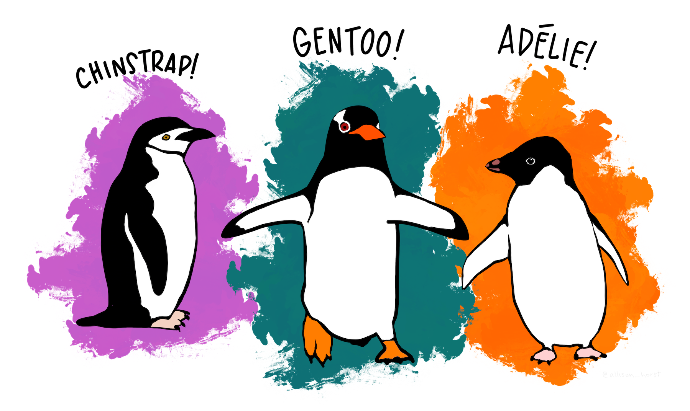
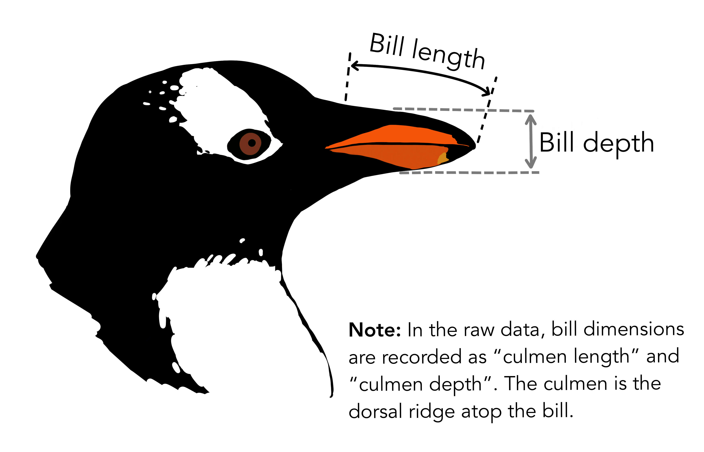

# Naive Bayes Classification

```{r, echo = FALSE}
adelie_color = "#fb7504"
chinstrap_color = "#c65ccc"
gentoo_color = "#067476"
```


**Learning objectives:**

* explore the pros and cons of naive Bayes classification
* generalize classification tasks for more than two categories

```{r, message = FALSE, warning = FALSE}
library("bayesrules")
library("dplyr")
library("e1071")
library("ggplot2")
library("ggtext")
library("janitor")
library("tidyr")

sessionInfo()
```


## Data: Palmer Penguins

There exist multiple penguin species throughout Antarctica, including the *Adelie*, *Chinstrap*, and *Gentoo*. When encountering one of these penguins on an Antarctic trip, we might *classify* its species

$$Y = \begin{cases} A & \text{Adelie} \\ C & \text{Chinstrap} \\ G & \text{Gentoo} \end{cases}$$



$X_{1}$ categorical variable: whether the penguin weighs more than the average 4200 grams

$$X_{1} = \begin{cases} 1 & \text{above-average weight} \\ 0 & \text{below-average weight} \end{cases}$$



numerical variables:

$$\begin{array}{rcl}
  X_{2} & = & \text{bill length (mm)} \\
  X_{3} & = & \text{flipper length (mm)} \\
\end{array}$$

```{r}
data(penguins_bayes)
penguins <- penguins_bayes

adelie_color = "#fb7504"
chinstrap_color = "#c65ccc"
gentoo_color = "#067476"

penguins %>% 
  tabyl(species)
```


## Naive Bayes Classification

Here, we have *three* categories, whereas logistic regression is limited to classifying *binary* response variables.  As an alternative, **naive Bayes classification** 

* can classify categorical response variables $Y$ with two or more categories
* doesn’t require much theory beyond Bayes’ Rule
* it’s computationally efficient, i.e., doesn’t require MCMC simulation

But why is it called "naive"?


## One Categorical Predictor

Suppose an Antarctic researcher comes across a penguin that weighs less than 4200g with a 195mm-long flipper and 50mm-long bill. Our goal is to help this researcher identify the species of this penguin: Adelie, Chinstrap, or Gentoo

```{r, echo = FALSE}
penguins |>
  drop_na(above_average_weight) |>
  ggplot(aes(fill = above_average_weight, x = species)) + 
  geom_bar(position = "fill") + 
  labs(title = "<span style = 'color:#067476'>For which species is a<br>below-average weight most likely?</span>",
       subtitle = "(focus on the <span style = 'color:#c65ccc'>below-average</span> category)",
       caption = "R4DS Book Club") +
  scale_fill_manual(values = c("#c65ccc", "#fb7504")) +
  theme_minimal() +
  theme(plot.title = element_markdown(face = "bold", size = 24),
        plot.subtitle = element_markdown(size = 16))
```

<details>
<summary>image code</summary>
```{r, eval = FALSE}
penguins |>
  drop_na(above_average_weight) |>
  ggplot(aes(fill = above_average_weight, x = species)) + 
  geom_bar(position = "fill") + 
  labs(title = "<span style = 'color:#067476'>For which species is a<br>below-average weight most likely?</span>",
       subtitle = "(focus on the <span style = 'color:#c65ccc'>below-average</span> category)",
       caption = "R4DS Book Club") +
  scale_fill_manual(values = c("#c65ccc", "#fb7504")) +
  theme_minimal() +
  theme(plot.title = element_markdown(face = "bold", size = 24),
        plot.subtitle = element_markdown(size = 16))
```
</details>

### Recall: Bayes Rule

$$f(y|x_{1}) = \frac{\text{prior}\cdot\text{likelihood}}{\text{normalizing constant}} = \frac{f(y) \cdot L(y|x_{1})}{f(x_{1})}$$
where, by the Law of Total Probability,

$$\begin{array}{rcl}
f(x_{1} & = & \displaystyle\sum_{\text{all } y'} f(y')L(y'|x_{1}) \\
~ & = & f(y' = A)L(y' = A|x_{1}) + f(y' = C)L(y' = C|x_{1}) + f(y' = G)L(y' = G|x_{1}) \\
\end{array}$$

over our three penguin species.

### Calculation

```{r}
penguins %>% 
  select(species, above_average_weight) %>% 
  na.omit() %>% 
  tabyl(species, above_average_weight) %>% 
  adorn_totals(c("row", "col"))
```

Prior probabilities:

$$f(y = A) = \frac{151}{342}, \quad f(y = C) = \frac{68}{342}, \quad f(y = G) = \frac{123}{342}$$

Likelihoods:

$$\begin{array}{rcccl}
  L(y = A | x_{1} = 0) & = & \frac{126}{151} & \approx & 0.8344 \\
  L(y = C | x_{1} = 0) & = & \frac{61}{68} & \approx & 0.8971 \\
  L(y = G | x_{1} = 0) & = & \frac{6}{123} & \approx & 0.0488 \\
\end{array}$$

Total probability:

$$f(x_{1} = 0) = \frac{151}{342}\cdot\frac{126}{151} + \frac{68}{342}\cdot\frac{61}{68} + \frac{123}{342}\cdot\frac{6}{123} = \frac{193}{342}$$

Bayes' Rules:

$$\begin{array}{rcccccl}
  f(y = A | x_{1} = 0) & = & \frac{f(y = A) \cdot L(y = A | x_{1} = 0)}{f(x_{1} = 0)} = \frac{\frac{151}{342}\cdot\frac{126}{151}}{\frac{193}{342}} & \approx & 0.6528 \\
  f(y = C | x_{1} = 0) & = & \frac{f(y = A) \cdot L(y = C | x_{1} = 0)}{f(x_{1} = 0)} = \frac{\frac{68}{342}\cdot\frac{61}{68}}{\frac{193}{342}} & \approx & 0.3161 \\
  f(y = G | x_{1} = 0) & = & \frac{f(y = A) \cdot L(y = G | x_{1} = 0)}{f(x_{1} = 0)} = \frac{\frac{123}{342}\cdot\frac{6}{123}}{\frac{193}{342}} & \approx & 0.0311 \\
\end{array}$$

The posterior probability that this penguin is an Adelie is more than double that of the other two species


## One Numerical Predictor

Let’s ignore the penguin’s weight for now and classify its species using only the fact that it has a 50mm-long bill

```{r, echo = FALSE, message = FALSE, warning = FALSE}
penguins|>
  ggplot(aes(x = bill_length_mm, fill = species)) + 
  geom_density(alpha = 0.7) + 
  geom_vline(xintercept = 50, linetype = "dashed", linewidth = 3) + 
  labs(title = "<span style = 'color:#c65ccc'>For which species is a<br>50mm-long bill the most common?</span>",
       subtitle = "one numerical predictor",
       caption = "R4DS Book Club") +
  scale_fill_manual(values = c(adelie_color, chinstrap_color, gentoo_color)) +
  theme_minimal() +
  theme(plot.title = element_markdown(face = "bold", size = 24),
        plot.subtitle = element_markdown(size = 16))
```

<details>
<summary>image code</summary>
```{r, eval = FALSE, message = FALSE, warning = FALSE}
penguins|>
  ggplot(aes(x = bill_length_mm, fill = species)) + 
  geom_density(alpha = 0.7) + 
  geom_vline(xintercept = 50, linetype = "dashed", linewidth = 3) + 
  labs(title = "<span style = 'color:#c65ccc'>For which species is a<br>50mm-long bill the most common?</span>",
       subtitle = "one numerical predictor",
       caption = "R4DS Book Club") +
  scale_fill_manual(values = c(adelie_color, chinstrap_color, gentoo_color)) +
  theme_minimal() +
  theme(plot.title = element_markdown(face = "bold", size = 24),
        plot.subtitle = element_markdown(size = 16))
```
</details>

Our data points to our penguin being a Chinstrap

* we must weigh this data against the fact that Chinstraps are the rarest of these three species
* difficult to compute likelihood $L(y = A | x_{2} = 50)$

This is where one “*naive*” part of naive Bayes classification comes into play. The naive Bayes method typically assumes that any quantitative predictor, here $X_{2}$, is **continuous** and **conditionally normal**:

$$\begin{array}{rcl}
  X_{2} | (Y = A) & \sim & N(\mu_{A}, \sigma_{A}^{2}) \\
  X_{2} | (Y = C) & \sim & N(\mu_{C}, \sigma_{C}^{2}) \\
  X_{2} | (Y = G) & \sim & N(\mu_{G}, \sigma_{G}^{2}) \\
\end{array}$$

### Prior Probability Distributions

```{r}
# Calculate sample mean and sd for each Y group
penguins %>% 
  group_by(species) %>% 
  summarize(mean = mean(bill_length_mm, na.rm = TRUE), 
            sd = sd(bill_length_mm, na.rm = TRUE))
```

```{r, eval = FALSE, message = FALSE, warning = FALSE}
penguins |>
  ggplot(aes(x = bill_length_mm, color = species)) + 
  stat_function(fun = dnorm, args = list(mean = 38.8, sd = 2.66), 
                aes(color = "Adelie"), linewidth = 3) +
  stat_function(fun = dnorm, args = list(mean = 48.8, sd = 3.34),
                aes(color = "Chinstrap"), linewidth = 3) +
  stat_function(fun = dnorm, args = list(mean = 47.5, sd = 3.08),
                aes(color = "Gentoo"), linewidth = 3) +
  ...
```

```{r, echo = FALSE, message = FALSE, warning = FALSE}
penguins |>
  ggplot(aes(x = bill_length_mm, color = species)) + 
  stat_function(fun = dnorm, args = list(mean = 38.8, sd = 2.66), 
                aes(color = "Adelie"), linewidth = 3) +
  stat_function(fun = dnorm, args = list(mean = 48.8, sd = 3.34),
                aes(color = "Chinstrap"), linewidth = 3) +
  stat_function(fun = dnorm, args = list(mean = 47.5, sd = 3.08),
                aes(color = "Gentoo"), linewidth = 3) + 
  geom_vline(xintercept = 50, linetype = "dashed") + 
  labs(title = "<span style = 'color:#c65ccc'>Prior Probabilities</span>",
       subtitle = "conditionally normal",
       caption = "R4DS Book Club") +
  scale_color_manual(values = c(adelie_color, chinstrap_color, gentoo_color)) +
  theme_minimal() +
  theme(plot.title = element_markdown(face = "bold", size = 24),
        plot.subtitle = element_markdown(size = 16))
```


<details>
<summary>image code</summary>
```{r, eval = FALSE}
penguins |>
  ggplot(aes(x = bill_length_mm, color = species)) + 
  stat_function(fun = dnorm, args = list(mean = 38.8, sd = 2.66), 
                aes(color = "Adelie"), linewidth = 3) +
  stat_function(fun = dnorm, args = list(mean = 48.8, sd = 3.34),
                aes(color = "Chinstrap"), linewidth = 3) +
  stat_function(fun = dnorm, args = list(mean = 47.5, sd = 3.08),
                aes(color = "Gentoo"), linewidth = 3) + 
  geom_vline(xintercept = 50, linetype = "dashed") + 
  labs(title = "<span style = 'color:#c65ccc'>Prior Probabilities</span>",
       subtitle = "conditionally normal",
       caption = "R4DS Book Club") +
  scale_color_manual(values = c(adelie_color, chinstrap_color, gentoo_color)) +
  theme_minimal() +
  theme(plot.title = element_markdown(face = "bold", size = 24),
        plot.subtitle = element_markdown(size = 16))
```

</details>

Computing the likelihoods in `R`:

```{r, eval = FALSE}
# L(y = A | x_2 = 50) = 2.12e-05
dnorm(50, mean = 38.8, sd = 2.66)

# L(y = C | x_2 = 50) = 0.112
dnorm(50, mean = 48.8, sd = 3.34)

# L(y = G | x_2 = 50) = 0.09317
dnorm(50, mean = 47.5, sd = 3.08)
```

Total probability:

$$f(x_{2} = 50) = \frac{151}{342} \cdot 0.0000212 + \frac{68}{342} \cdot 0.112 + \frac{123}{342} \cdot 0.09317 \approx 0.05579$$

Bayes' Rules:

$$\begin{array}{rcccccl}
  f(y = A | x_{2} = 50) & = & \frac{f(y = A) \cdot L(y = A | x_{1} = 0)}{f(x_{1} = 0)} = \frac{\frac{151}{342} \cdot 0.0000212}{0.05579} & \approx & 0.0002 \\
  f(y = C | x_{2} = 50) & = & \frac{f(y = A) \cdot L(y = C | x_{1} = 0)}{f(x_{1} = 0)} = \frac{\frac{68}{342} \cdot 0.112}{0.05579} & \approx & 0.3992 \\
  f(y = G | x_{2} = 50) & = & \frac{f(y = A) \cdot L(y = G | x_{1} = 0)}{f(x_{1} = 0)} = \frac{\frac{123}{342} \cdot 0.09317}{0.05579} & \approx & 0.6006 \\
\end{array}$$

Though a 50mm-long bill is relatively less common among <span style = 'color:#067476'>Gentoo</span> than among <span style = 'color:#c65ccc'>Chinstrap</span>, it follows that our naive Bayes classification, based on our prior information and penguin’s bill length alone, is that this penguin is a <span style = 'color:#067476'>Gentoo</span> – it has the highest posterior probability.

We’ve now made two naive Bayes classifications of our penguin’s species, one based solely on the fact that our penguin has below-average weight and the other based solely on its 50mm-long bill (in addition to our prior information). And these classifications **disagree**: we classified the penguin as Adelie in the former analysis and Gentoo in the latter. This discrepancy indicates that there’s *room for improvement* in our naive Bayes classification method.


## Two Predictor Variables

```{r, echo = FALSE, message = FALSE, warning = FALSE}
penguins |>
ggplot(aes(x = flipper_length_mm, y = bill_length_mm, 
           color = species)) + 
  geom_point(size = 3) + 
  geom_segment(aes(x = 195, y = 30, xend = 195, yend = 50),
               color = "black", linetype = 2, linewidth = 2) +
  geom_segment(aes(x = 170, y = 50, xend = 195, yend = 50),
               color = "black", linetype = 2, linewidth = 2) +
  labs(title = "<span style = 'color:#c65ccc'>Two Predictor Variables</span>",
       subtitle = "50mm-long bill and 195mm-long flipper",
       caption = "R4DS Book Club") +
  scale_color_manual(values = c(adelie_color, chinstrap_color, gentoo_color)) +
  theme_minimal() +
  theme(plot.title = element_markdown(face = "bold", size = 24),
        plot.subtitle = element_markdown(size = 16))
```

<details>
<summary>image code</summary>
```{r, eval = FALSE, message = FALSE, warning = FALSE}
penguins |>
ggplot(aes(x = flipper_length_mm, y = bill_length_mm, 
           color = species)) + 
  geom_point(size = 3) + 
  geom_segment(aes(x = 195, y = 30, xend = 195, yend = 50),
               color = "black", linetype = 2, linewidth = 2) +
  geom_segment(aes(x = 170, y = 50, xend = 195, yend = 50),
               color = "black", linetype = 2, linewidth = 2) +
  labs(title = "<span style = 'color:#c65ccc'>Two Predictor Variables</span>",
       subtitle = "50mm-long bill and 195mm-long flipper",
       caption = "R4DS Book Club") +
  scale_color_manual(values = c(adelie_color, chinstrap_color, gentoo_color)) +
  theme_minimal() +
  theme(plot.title = element_markdown(face = "bold", size = 24),
        plot.subtitle = element_markdown(size = 16))
```
</details>

Generalizing Bayes' Rule:

$$f(y | x_{2}, x_{3}) = \frac{f(y) \cdot L(y | x_{2}, x_{3})}{\sum_{y'} f(y') \cdot L(y' | x_{2}, x_{3})}$$

Another "naive" assumption of **conditionally independent**:

$$L(y | x_{2}, x_{3}) = f(x_{2}, x_{3} | y) = f(x_{2} | y) \cdot f(x_{3} | y)$$

* mathematically efficient
* but what about correlation?

```{r}
# sample statistics of x_3: flipper length
penguins %>% 
  group_by(species) %>% 
  summarize(mean = mean(flipper_length_mm, na.rm = TRUE), 
            sd = sd(flipper_length_mm, na.rm = TRUE))
```

Likelihoods of a flipper length of 195 mm:

```{r, eval = FALSE}
# L(y = A | x_3 = 195) = 0.04554
dnorm(195, mean = 190, sd = 6.54)

# L(y = C | x_3 = 195) = 0.05541
dnorm(195, mean = 196, sd = 7.13)

# L(y = G | x_3 = 195) = 0.0001934
dnorm(195, mean = 217, sd = 6.48)
```

Total probability:

$$f(x_{2} = 50, x_{3} = 195) = \frac{151}{342} \cdot 0.0000212 \cdot 0.04554 + \frac{68}{342} \cdot 0.112 \cdot 0.05541 + \frac{123}{342} \cdot 0.09317 \cdot 0.0001931 \approx 0.001241$$

Bayes' Rules:

$$\begin{array}{rcccl}
  f(y = A | x_{2} = 50, x_{3} = 195) & = & \frac{\frac{151}{342} \cdot 0.0000212 \cdot 0.04554}{0.0001931} & \approx & 0.0003 \\
  f(y = C | x_{2} = 50, x_{3} = 195) & = & \frac{\frac{68}{342} \cdot 0.112 \cdot 0.05541}{0.0001931} & \approx & 0.9944 \\
  f(y = G | x_{2} = 50, x_{3} = 195) & = & \frac{\frac{123}{342} \cdot 0.09317 \cdot 0.0001931}{0.0001931} & \approx & 0.0052 \\
\end{array}$$

In conclusion, our penguin is *almost certainly* a <span style = 'color:#c65ccc'>Chinstrap</span>.


## Implementation

To implement naive Bayes classification in `R`, we’ll use the `naiveBayes()` function in the `e1071` package (Meyer et al. 2021)

### Models

```{r}
# two models
naive_model_1 <- naiveBayes(species ~ bill_length_mm, data = penguins)
naive_model_2 <- naiveBayes(species ~ bill_length_mm + flipper_length_mm, 
                            data = penguins)

# our penguin to classify
our_penguin <- data.frame(bill_length_mm = 50, flipper_length_mm = 195)
```

### Predictions

```{r}
predict(naive_model_1, newdata = our_penguin, type = "raw") |>
round(6)
```

```{r}
predict(naive_model_1, newdata = our_penguin)
```
```{r}
predict(naive_model_2, newdata = our_penguin, type = "raw") |>
round(6)
```

```{r}
predict(naive_model_2, newdata = our_penguin)
```

## Validation

### Confusion Matrices

```{r}
penguins <- penguins %>% 
  mutate(class_1 = predict(naive_model_1, newdata = .),
         class_2 = predict(naive_model_2, newdata = .))
```

```{r}
set.seed(84735)
penguins %>% 
  sample_n(4) %>% 
  select(bill_length_mm, flipper_length_mm, species, class_1, class_2) %>% 
  rename(bill = bill_length_mm, flipper = flipper_length_mm)
```

```{r}
# Confusion matrix for naive_model_1
penguins %>% 
  tabyl(species, class_1) %>% 
  adorn_percentages("row") %>% 
  adorn_pct_formatting(digits = 2) %>%
  adorn_ns()
```

* accuracy: 76 percent
* 85 percent of Chinstap penguins are misclassified as Gentoo!

```{r}
# Confusion matrix for naive_model_2
penguins %>% 
  tabyl(species, class_2) %>% 
  adorn_percentages("row") %>% 
  adorn_pct_formatting(digits = 2) %>%
  adorn_ns()
```

* accuracy: 95 percent

### Cross-Validation

```{r}
# 10-fold cross-validation
set.seed(84735)
cv_model_2 <- naive_classification_summary_cv(
  model = naive_model_2, data = penguins, y = "species", k = 10)
```

```{r}
cv_model_2$cv
```

## Summary

Naive Bayes

$$f(y | x_{1}, x_{2}, ..., x_{p}) = \frac{f(y) \cdot L(y | x_{1}, x_{2}, ..., x_{p})}{\sum_{y'} f(y') \cdot L(y' | x_{1}, x_{2}, ..., x_{p})}$$

* conditionally independent $\rightarrow$ computationally efficient
* generalizes to more than two categories
* assumptions violated commonly in practice

Logistic Regression

$$\log\left(\frac{\pi}{1-\pi}\right) = \beta_{0} + \beta_{1}X_{1} + \cdots + \beta_{k}X_{p}$$

* binary classification
* coefficients $\rightarrow$ illumination of the relationships among these variables


## Meeting Videos

### Cohort 1

`r knitr::include_url("https://www.youtube.com/embed/HeCaORJNdJM")`

<details>
<summary> Meeting chat log </summary>

```
00:44:10	defuneste:	plant@net
00:44:28	Lisa:	https://identify.plantnet.org/
00:48:49	Brendan Lam:	Thanks everyone!
```
</details>

### Cohort 2

`r knitr::include_url("https://www.youtube.com/embed/6Yma6P5h0IA")`


### Cohort 4

`r knitr::include_url("https://www.youtube.com/embed/URL")`

<details>
<summary> Meeting chat log </summary>

```
LOG
```
</details>
